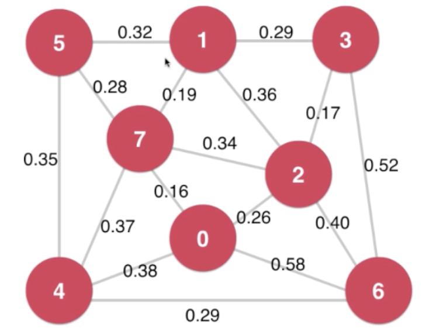

# 最小生成树 Minimum Span Tree

## 有权图 Weight Graph

#### 邻接矩阵 Adjacent Matrix

#### 邻接表

使用Edge 表示每一条连接边

##  最小生成树问题和切分定理

带权无向图、连通图

找V-1条边

#### 切分定理 Cut Property

把图中的节点分成两部分，成为一个**切分(Cut)**

如果一个边的两个端点，属于切分不同的两边，这个边成为**横切边(Crossing Edge)**;

切分定理：

给定任意切分，横切边中权值最小的边必然属于最小生成树

## Prim算法  Lazy Prim

Lazy Prim 最小堆中依然有不会是横切边的边。

Lazy Prim 的时间复杂度为O(ElogE)

## Prim 算法优化

时间复杂度O(ElogV)

IndexMinHeap

## Kruskal算法

使用并查集 

使用Union Find 快速判断环

## 最小生成树问题

**最小生成树问题思考**

Lazy Prim  O(ElogE)

Prim        O(ElogV)

Kruskal      O(ElogE)

**如果横切边有相等的边**

根据具体的算法实现，每次选择一个边

此时，图存在多个最小生成树

**Vyssotsky’s Algorithm**

将边逐渐添加到生成树中

一旦形成环，删除环中权值最大的边