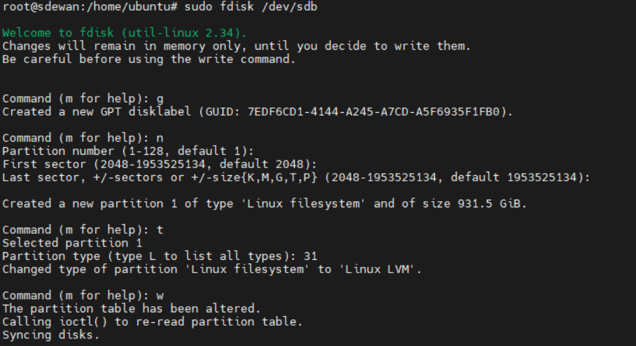
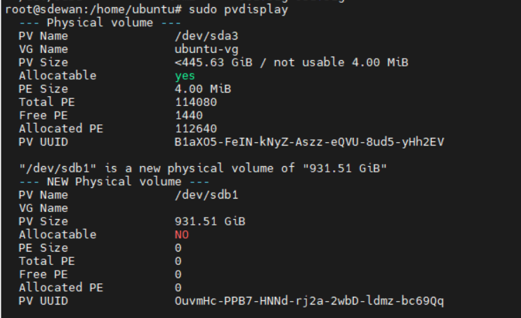

We have a sever for code test, but with the test case growth, the Disk space is not enough for use.

Fortunately, we use ubuntu LVM to manage the Disk.


```sh
fdisk /dev/sdb
```




```sh
pvdisplay
```


https://gyazo.com/40b3c078d6bb755f9cca318b3c28b2cf


```sh
vgextend ubuntu-vg /dev/sdc1
```


```sh
vgdisplay
```


```sh
lvdisplay
```


```sh
lvextend -l +100%FREE /dev/ubuntu-vg/ubuntu-lv
resize2fs /dev/ubuntu-vg/ubuntu-lv
```


Multipass extend VM disk size.

Multipass uses qemu to create the VM instance. So you can modify the qemu image manually to change the VM disk size.

1. Stop the VM

```sh
multipass stop vm-name
```

2. Find the VM image 

```sh
/var/snap/multipass/common/data/multipassd/vault/instances
```

3. Expand the size of the image

```sh
qemu-img resize xxx.img 200G
# qemu-img resize xxx.img +100G
```

4. Restart the VM

```sh
multipass start vm-name
```


https://blog.yqxpro.com/2021/10/31/%E9%80%9A%E8%BF%87LVM%E7%BB%99Ubuntu%E6%B7%BB%E5%8A%A0%E7%A1%AC%E7%9B%98%E7%A9%BA%E9%97%B4/


