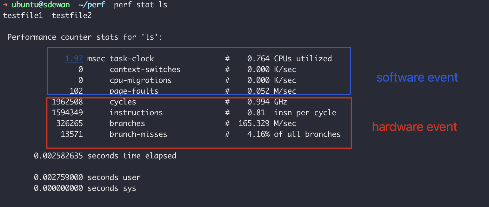
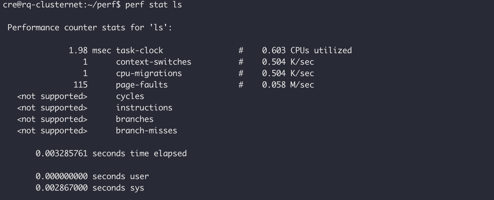
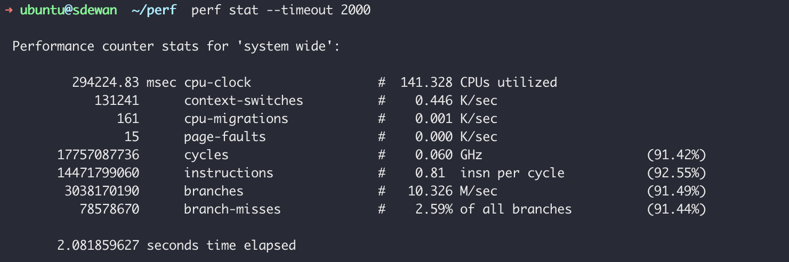

### Linux Performance Counter

#### Hardware Event

CPU

Performance Monitor Unit

- Instruction retired
- Processor clock cycles

Cache

#### Software Event

Software counter/tracepoint

- Page fault
- process context


Tracepints is the hook in the Linux kernel. 在特定代码执行的时候会被触发。

```sh
ls /sys/kernel/debug/tracing/events
```




If the machine not a baremetal, it can't collect hardware event. For example in a esxi VM.



> Request
>
> - LLC-load-misses
> - Instructions
> - Cycles
>
> The ODMS containes now:
>
> Dashboard consists of 12 panels based on following metrics:
>
> - Core:
>   - utilization (%)
>   - frequency (GHz)
>   - CPI (cycle per instruction)
>   - L2 MPI (count per instruction)
>   - DRAM BW (MB/sec)
>   - LLC MPI (count per instruction)
>   - TMAM Branch Mispredictspercent (%)
>   - TMAM L1 Boundpercent (%)
> - Uncore:
>   - LLC MPI (count per instruction)
>   - memory bandwidth total (MB/sec)
>   - memory bandwidth read (MB/sec)
>   - memory bandwidth write (MB/sec)


What is PMU？

Performance monitor Unit


### LLC-load-misses

The number of `LLC-load-misses` should be interpreted as the numver of loads that miss in the last level cache(typically the L3 for modern Intel chips) over the interval measures.

At the level this is measured, I believe loads going to the same cache line have already been "combined" by the line fill buffers: if you access several values all the same cache line which isn't presented in the LLC, these all "miss" from the point of view of your process (the use of any of those values will wait for the full miss duration), but I believe this is only counted as one miss for the `LLC-load-misses` counter.


### Instructions


instructions: IPC instructions per cycyle.

banches:

Branch-misses:


### Cycles


### Perf Install 

```sh
# ubuntu
sudo apt install -y linux-tools-$( uname -a |awk '{print $3}')
```


基于性能分析，可以进行算法优化（空间复杂度和时间复杂度权衡）、代码优化（提高执行速度、减少内存占用）。

评估程序对硬件资源的使用情况，例如各级cache的访问次数、各级cache的丢失次数、流水线停顿周期、前端总线访问次数等。

评估程序对操作系统资源的使用情况，系统调用次数、上下文切换次数、任务迁移次数。

事件可以分为三种：

1. Hardware Event由PMU部件产生，在特定的条件下探测性能事件是否发生以及发生的次数。比如cache命中。
2. Software Event是内核产生的事件，分布在各个功能模块中，统计和操作系统相关性能事件。比如进程切换，tick数等。
3. Tracepoint Event是内核中静态tracepoint所触发的事件，这些tracepoint用来判断程序运行期间内核的行为细节，比如slab分配器的分配次数等。


## perf stat

perf stat: 执行某个命令，收集特定进程的性能概况，包括CPI，Cache丢失率。可以对某一个进程进行全局的性能统计。

perf top: 类似于linux的top命令，对系统性能进行实时分析，可以实时查看当前系统


perf stat 用于运行指令，并分析其统计结果。虽然perf top也可以指定pid，但是需要先启动应用才能查看信息，而perf stat则可以直接用来启动程序。

perf stat 能完整统计应用程序整个声明周期的信息。

```sh
perf stat [-e <EVENT> | --event=EVENT ] [-a] <command>
```





`cpu-clock` 任务真正占用处理器的时间，单位ms， CPU utilized = task-clock/time elapsed

`context-switch`: 程序运行过程中上下文的切换次数

`cpu-migrations`:  程序再运行过程中发生的处理器迁移次数。Linux为了维持多个处理器的负载均衡，会在特定条件下将某任务从一个CPU迁移到另一个CPU。 发生上下文切换不一定会发生cpu迁移，而发生CPU迁移时肯定会发生上下文切换。发生上下文切换有可能只是把上下文从当前cpu换出，下一次调度器还是讲进程安排在这个cpu上执行。

`page-faults`:缺页异常的次数。当应用程序请求的页面尚未建立、请求的页面不在内存中。或者请求的页面虽然在内存中，但是物理地址和虚拟地址的映射关系未建立时，都会触发一次缺页中断异常。另外TLB不命中，页面访问权限不匹配等情况也会触发缺页异常。

`cpu-cycles`: 消耗的处理周期数    主频 = cycles/task-clock

`instructions:` 执行了多少条指令 IPC(instructions per cycle) 平均每个cpu cycle指定了多指令

`branches`: 遇到的分支指令数

`branches-misses` : 预测错误的分支指令数


### Demo

以下示例程序`perf_test.c`. longa()是一个很长的循环

```c
void longa() 
{ 
	int i,j; 
	
	for(i = 0; i < 1000000; i++) 
		j=i; 			//am I silly or crazy? I feel boring and desperate. 
} 

void foo1() 
{ 
	int i; 
	
	for(i = 0; i< 100; i++) 
		longa(); 
}

void foo2() 
{ 
	int i; 
	
	for(i=0 ; i < 10; i++) 
		longa(); 
} 


int main(int argc, char *argv[]) 
{ 
	foo1(); 
	foo2(); 
	
	return 0x0;
}

```

执行下面的命令进行编译

```sh
gcc -g -o perf_test perf_test.c
```

使用perf stat 剖析这个程序

```sh
perf stat ./perf_test
```

从测试结果可以看出是cpu bound型，以为task-clock-msecs接近1

有些程序慢是因为计算量太大，其多数时间都在使用CPU进行计算，这叫做CPU bound型。有些程序慢是因为IO过多，这种时候其CPU利用率应该不高，这叫做IO bound型。


perf stat 更多统计项目

Perf stat 默认情况下只统计部分项目，如果想要统计更多的项目可以使用-e参数指定

```sh

# sudo perf stat -e task-clock,context-switches,cpu-migrations,page-faults,cycles,stalled-cycles-frontend,stalled-cycles-backend, \
instructions,branches,branch-misses,L1-dcache-loads,L1-dcache-load-misses,LLC-loads,LLC-load-misses,dTLB-loads,dTLB-load-misses ls
```


## perf record/report


perf record 记录单个函数级别的统计信息，并使用 perf report 来显示统计结果。

我们的调优应当将注意力集中到百分比比较高的热点代码片段上。

```sh
perf record -e cpu-clock ./perf_test
// 默认导出的文件名为 perf.data, 也可以使用-o选项来指定导出的文件
```

使用perf report来分析

```sh
perf report -i ./perf.data
```


使用 perf record的-g选项可以获得更加详细的信息

```sh
perf record -e cpu-clock -g ./perf_test
```


> Epoll


## Reference

https://ivanzz1001.github.io/records/post/linuxops/2017/11/16/linux-perf-usge   !!!!! Important

https://www.cnblogs.com/arnoldlu/p/6241297.html

https://developer.aliyun.com/article/65255#slide-21

https://zhuanlan.zhihu.com/p/141694060
