软件开发的新挑战

- 多核硬件架构

- 超大规模分布式计算集群

- web模式下导致的前所未有的规模和更新速度

区块链开发语言，

Kubernetes

Docker

只有25个关键字

有垃圾回收机制，但是仍然可以直接使用指针访问内存

CSP并发机制

关键字

c 37

c++ 11 84

go 25


go 垃圾回收，使用指针直接内存访问.

复合和继承

docker kubernetes


go 默认使用静态连接，编译完成是一个独立的二进制

```go
package main // package name

import "fmt" // dependence

// functionality
func main() {
	fmt.Print("hello world \n")
}
```

应用程序入口， 

1. 必须是main包 package main
2. 必须是main方法 func main()
3. 文件名不一定是main.go

package 的名字不需要与目录保持一致


退出返回值

与其他主要编程语言的差异

- Go main函数不支持任何返回值
- 通过os.Exit 来返回状态

```go
package main

import (
	"fmt"
	"os"
)

func main() {
	fmt.Print("hello world \n")
	os.Exit(-1)
}
```


获取命令行参数

- main函数不支持传入参数

  func main(~~arg []string~~)

- 在程序中直接通过os.Args 获取命令行参数

  获取的第一个参数是文件执行的相对路径，也就是文件名

```go
package main

import (
	"fmt"
	"os"
)

func main() {
	if len(os.Args) > 1 {
		fmt.Println("hello world",os.Args[1])
	}
	os.Exit(1)
}
```


The master has failed more time than the beginner has tried.


编写测试程序

源码文件以_test 结尾，xxx_test.go

测试方法名以 Test 开头, func TestXXX( t *testing.T){...}


```sh
package test

import "testing"

func TestFirstTry(t *testing.T ){
	t.Log("hello test")
}
```


变量赋值

- 赋值可以自动类型推断
- 在一个赋值语句中，可以对多个变量同时赋值


```go
var a int = 1
var b int = 2
var (
	c int = 1
    // go 类型推断
    d  = 2
    e := 3
)

```


常量定义，快速的连续值的设置


数据类型

```sh
bool
string
int int8 int16 int32 int64
uint unit8 uint16 uint32 uint64
byte # alias for uint8
rune # alias for int32,represents a Unicode code point
float32 float64
complex64 complex128
```

类型转化

- 不允许隐式类型转换
- 别名和原有类型也不能进行隐式类型转换


类型的预定义值

math.MaxInt64

math.MaxFloat64

math.MaxUint32


指针类型

- 不支持指针运算
- string 是值类型，其默认初始化值为空字符串，而不是nil

算术运算符

```sh
+ - * / % 
++ 
--
# 没有前置的 ++ -- // ++a
```

比较运算符

```sh
==
!=
> < 
>= <=
```

用 == 比较数组

- 相同维数，且含有相同个数元素的数组才可以比较
- 每个元素都相同时才相等（顺序）


长度不同的数组比较会有一个编译错误

逻辑运算符

```sh
&&  || !
```


位运算符

```sh
& ! ^ 
<< >>

&^  按位置0

1 &^ 0 -- 1  # 右边的操作书为0，左边不变
1 &^ 1 -- 0  # 右边的操作数为1，左边则为0
0 &^ 1 -- 0
0 &^ 0 -- 0

```


循环

仅支持循环关键字 for


```go
for j:=7;j<n ;j++{

}

for n< 5{
    n++
}

for {
    
}
```

条件

- condition 表达式结果必须为bool值

- 支持变量赋值

  ```go
  if var declaration; condition{
      
  }
  ```

  

```go
if condition{
    
}else{
    
}

if condition-1{
    
}else if condition-2{
    
}else{
    
}
```


switch 条件

- 条件不限制为常量或者整数
- 单个case中可以出现多个结果选项，使用逗号分隔
- 不需要用break用来推出当前case
- 可以不设置switch之后的条件表达式，在这种情况下，switch结构与多个if...else 的逻辑作用相同。

```go
switch os := runtime.GOOS; os{
    case "darwin":
    fmt.Println("Mac OS")
    // break
    case "linux":
    fmt.Println("Linux")
    default：
    // freebsd, openbsd, plan9, windows..
    fmt.Printf("%s",os)
}


switch{
    case 0<=NUM && NUM <=3:
    fmt.Printf("0-3")
    case 4 <=NUM && NUM <= 6:
    fmt.Printf("4-6")
    case 7<=NUM && NUM <= 9:
    fmt.Printf("7-9")
}
```


连续存储空间

数组: 

```go
var a [3]int // 声明并初始化为默认零值
a[0] = 1

b := [3]int{1,2,3}  // 声明并初始化
c := [2][2]int{{1,2},{3,4}} // 多维数组
```

数组元素遍历

```go
func TestArrayTravel(t *testing.T) {
	arr := [...]int{1, 2, 3, 4, 5}
	for idx, i := range arr {
		t.Log(idx, i)
	}
}
```


数组截取

a[开始索引(包含)，结束索引(不包含)],  左闭右开区间

```go
a:= [...]int{1, 2, 3, 4, 5}
a[1:2] // 2
a[1:3] // 2,3
a[1:len(1)] // 2,3,4,5
a[1:] // 2,3,4,5
a[:3]  // 1,2,3
```


切片Slice

切片内部结构，会造成大量GC


https://gyazo.com/b4dd7a1f65dcab076fc41d9dfac95180


prt -> Array 的地址

len 可以访问的元素个数，

cap 内部数组的容量

```go
var s0 []int
s0 = append(s0, 1)

s := []int
s1 := []int{1,2,3}
s2 := make([]int,2,4)
/* []type,len,cap 
其中len个元素会被初始化为默认零值，未初始化元素不可访问
*/
```


切片共享存储结构


https://gyazo.com/96049daf69a2855181cedd023fe396d8


1024 以下是2的倍数，大于1024 约 1.25倍

自增长的代价


数组VS 切片

- 容量是否可以伸缩

- 是否可以进行比较 

slice 只能与nil 进行比较？？


Map 声明

```go
m := map[stirng]int{"one":1,"two":2,"three":3}
m1 := map[string]int
m1["one"] = 1
m2 := make(ma)

m2 := make(map[string]int, 10 )
// 10 initial capacity
// 为什么不初始化len， 会出事化为默认零值，所以不需要
// cap 无法计算map 容量。 len 可以计算map 数据长度
```


map 不存在的时候默认会零值，可能会有歧义

在访问的key不存在的时候，仍会返回零值，不能通过nil来判断元素是否存在。


map 遍历， map 是否是有序的


map 与工厂模式， 实现set

函数是一等公民

- map的value也可能是一个方法
- 与go 的duck type 接口方式一起，可以方便的实现单一方法对象的工厂模式


实现Set

go 内置集合中没有set实现，可以map[type]struct{}

1. 元素的唯一性
2. 基本操作
   - 添加元素
   - 判断元素是否存在
   - 删除元素
   - 元素个数


字符串

unicode，utf8

- string 是数据类型，不是引用或者指针类型
- string是只读的byte slice， len函数可以计算所包含的byte数
- string的byte数组可以存放任何数据， 不可见二进制编码


string 是一个不可变的 byte slice


unicode UTF8

- Unicode 是一种字符集(code point)
- UTF8 是unicode的存储实现（转换为字节序列的规则）


字符  “中"

Unicode 0x4E2D

UTF-8   0xE4B8AD

string/[]byte  [0xE4, 0xB8, 0xAD]


常用字符串函数

strings 

strconv


函数 一等公民

- 可以有多个返回值
- 所有的参数都是值传递， slice，map, channel
- 函数可以作为变量的值
- 函数可以作为参数的和返回值


类似于装饰器的demo， 重用

《计算机程序的构造和解释》 函数式编程


可变参数, 类型一直，无需指定参数的个数

```go
func sum(ops ...int)int{
	s := 0
	for _,op := ops{
		s +=op
	}
    return s
}
```


defer 函数

释放锁，或者关闭资源，避免资源的浪费

```sh

```

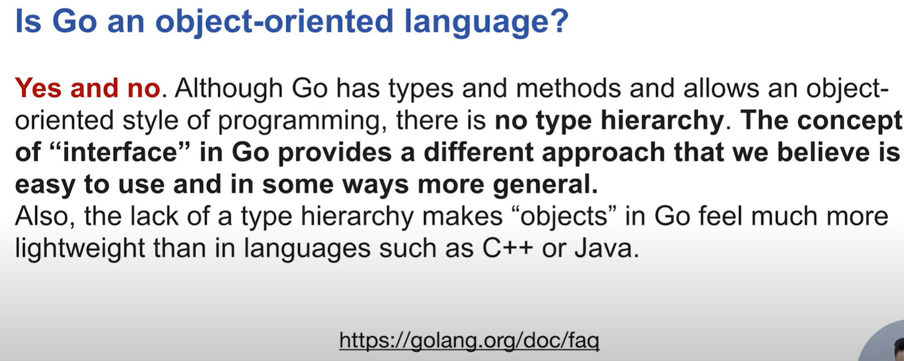


封装数据和行为

结构体定义

```go
type Employee struct{
    Id string
    Name string
    Age int
}

e := Employee{"0","Bob",20}
e1 := Employee{Name:"Mike",Age:20}
e2 := new(Employee) // 注意，这里返回的是引用/指针, 相当于 e := &Employee{}
e2.Id = "2"   // 与其他编程语言的差异，通过实例的指针访问成员不需要 ->
e2.Age = 22
e2.Name = "Rose"
```


行为方法定义

```go
// 第一中方式在实例对应的方法被调用时，实例的成员会进行值复制
func(e Employee) String（） string{
    return fmt.Sprintf("ID:%s-Name:%s-Age:%s", e.Id,e.Name,e.Age)
}

// 通常情况下为了避免内存copy我们使用第二种方式
func(e *Employee) String（） string{
    return fmt.Sprintf("ID:%s-Name:%s-Age:%s", e.Id,e.Name,e.Age)
}
```


Go语言的相关接口

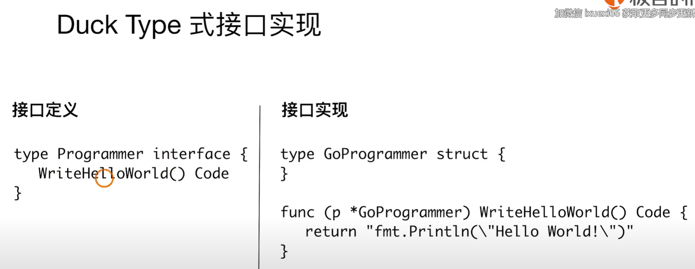


- 接口为非侵入性，实现不依赖与接口定义
- 所有接口的定义可以包含在接口使用者包内（解决循环依赖）

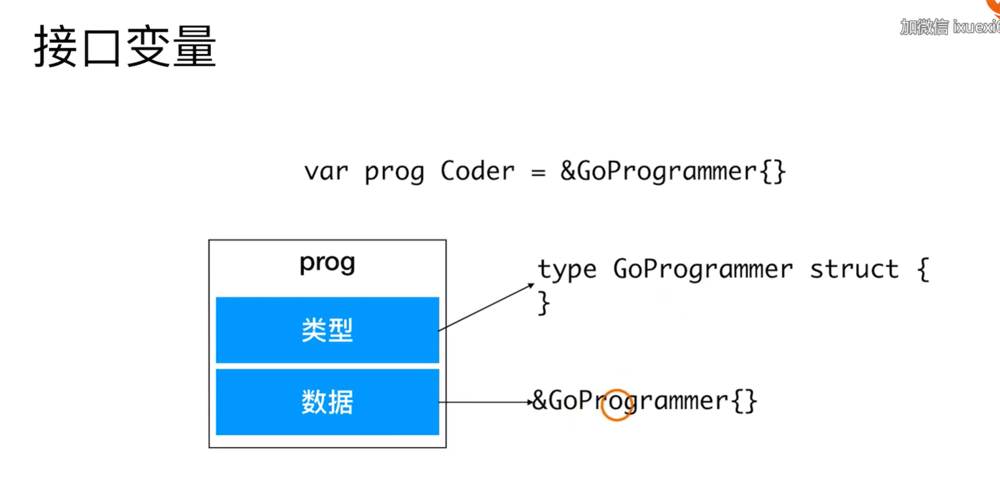

interface 判断是否为nil


自定义类型

```go
type IntConvertionFn func(n int) int // 自定义函数类型
type MyPoint int
```


扩展与服用

复合vs继承

不支持LSP 原则


匿名嵌套类型

- 无法重载父类的方法


多态

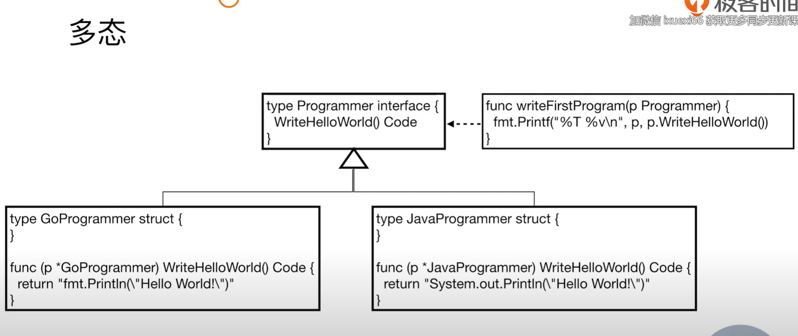


interface 对应的只能是一个struct的指针


空interface

- 空接口可以表示任何类型

- 通过断言将空接口转换为定制类型

  ```go
  v,ok := p.(int) // ok=true 时转换成功
  ```


Go 接口最佳实现

single method interface

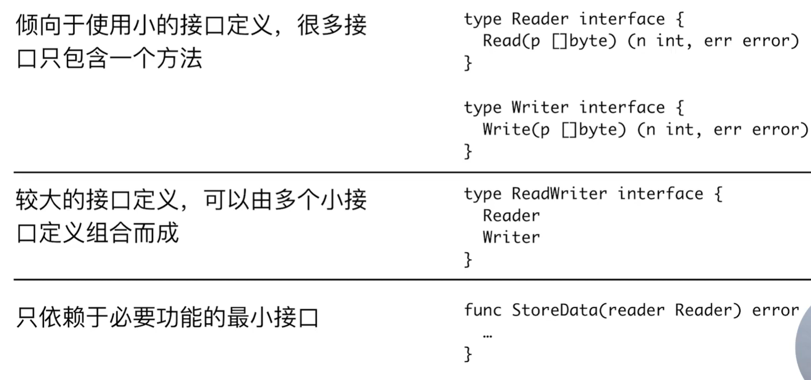


错误处理
没有异常机制，

GO的错误机制

- 没有异常机制
- error 类型实现了error 接口
- 可以通过errors.New 来快速创建错误实例

```go
type error interface{
    Error() string
}

errors.New("n must be in range[0,10]")

```


有错误及早失败，避免嵌套


package

- 基本复用的模块单元

  首字母大写表明可以被包外的代码访问

- 代码的package 可以和所在的目录不一致

- 同一目录里的Go代码的Package要保持一致


init 

- 在main被执行前，所有依赖的package的init方法都会被执行
- 不通包的init函数按照包导入的依赖关系决定执行顺序
- 每个包可以有多个init函数
- 包的每一个源文件也可以有多个init函数，


go get -u < module name/ 源码的github 路径 >

go get -u 强制从网络更新远程依赖


panic 

- 用于不可恢复的错误
- 推出前会执行defer的内容

os.Exit（） 退出时不会调用defer指定的函数

os.Exit（） 退出时不会调用当前栈信息

recover

```sh
# java
try{
}catch(Throwable t){}
# c++
try{}catch(..){}
```

```go
defer func(){
    if err := recover(); err != nil{
        // 恢复错误
    }
}()
```


最常见的“错误恢复”

```go
defer func(){
    if err:= recover(); err!= nil{
        log.Error("recoverd panic",err)
    } 
}()
// 当心recover成为恶魔
// 形成僵尸服务进程，导致health check失效
// "Let it creash" 往往是我们恢复不确定性错误的最好方法
// 让守护进程重启服务
```


依赖管理

- 同一环境下，不同项目使用同一包的不同版本？
- 无法管理对包的特定版本的依赖？

vendor路径

查找依赖包路径的顺序

- 在当前包的vendor目录
- 向上级目录查找，直到找到src 下的vendor目录
- 在GOPATH下面查找依赖包
- 在GOROOT目录下查找


现在都用go mod


协程机制

Thread VS Goutine

1. 创建时默认stack的大小
   - JDK5以后JAVA Thread Stack 默认为1M
   - Goroutine 的Stack初始化大小为2k
2. 和KSE(kernel space entity)的对应关系
   - Java Thread 是1：1
   - Goroutine 是M:N

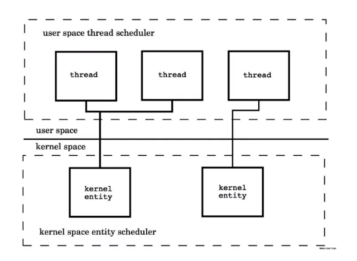

线程切换 context的消耗高

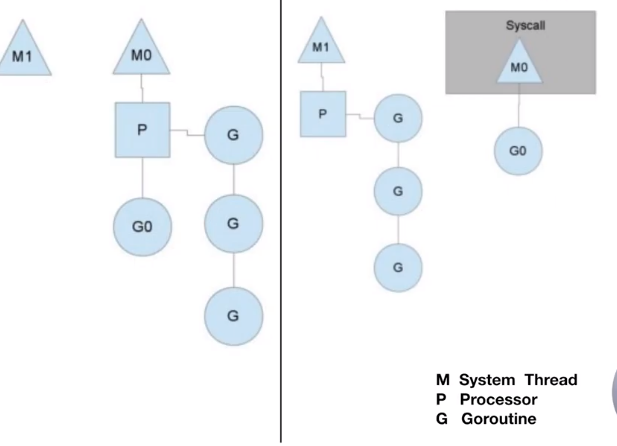

计数每个processer完成的数量

如果系统进程在等待IO了，P会绑定其他的系统线程


使用协程的时候注意闭包的参数传递


共享内存和并发机制

Lock

```c++
Lock lock=...;
lock.lock()
try{
	// process
}catch(Exception ex){
    
}finally{
    lock.unlock
}
```


```go
package sync
mutex
RWLock
```


WaitGroup

RWLock  读不是互斥的


CSP (Communicating Sequential processes)并发控制

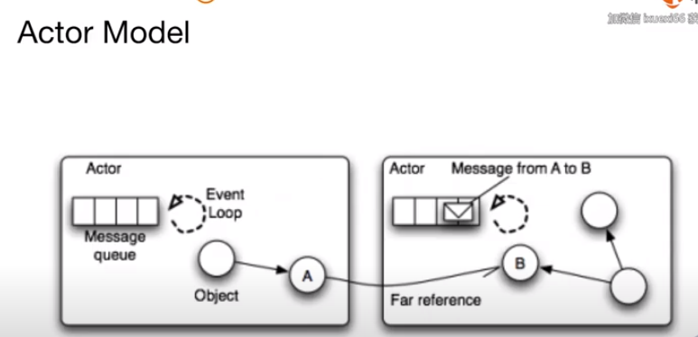


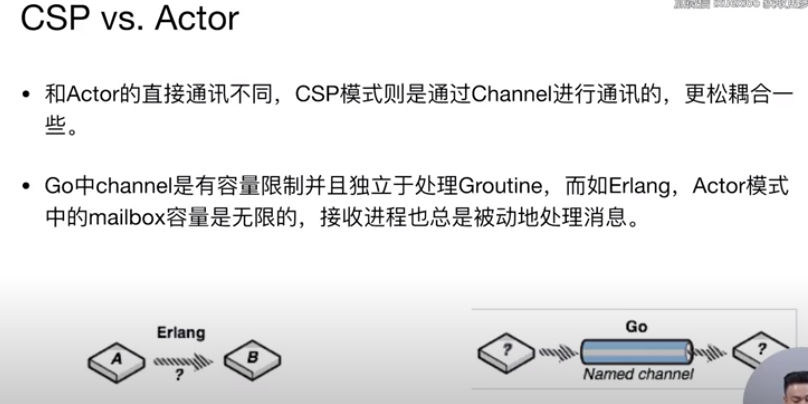

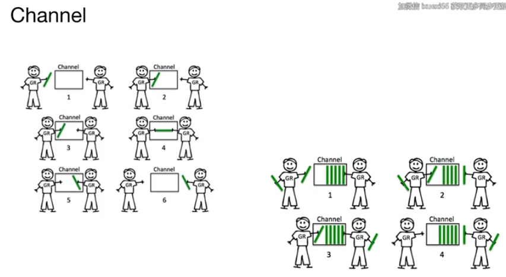

无buffer 的等待（双方都在）


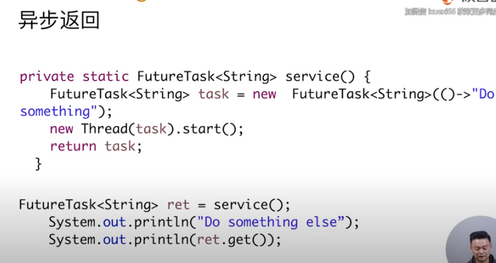

 

多路选择和超时控制

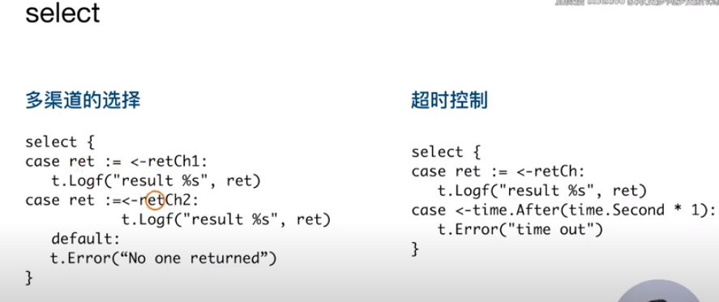

如果 retCh1 和retCH2 都ready的情况下，无法保证select的顺序。

如果没有default会阻塞在select session上


雪崩是比quick fail还要可怕的一种错误


channel 的关闭和广播


channel的关闭

- 向关闭的channel发送数据，会导致panic

- 接受关闭的通道的数据，接受到的是对应数据类型的零值，如果通道未关闭，且通道中没有数据，接受者会阻塞

- v,ok <- ch， ok 为bool值，true表示正常接受，false表示通道关闭

- 所有channel接受者都会在channel关闭时，立刻从阻塞等待中返回，且上述ok值为false。这个广播机制常被利用，进行向多个订阅者同时发送信号。如，退出信号。

  


无锁队列？？？


多个receiver的情况下


生产者在数据发送完成后可以关闭channel


任务的取消（多消费者）


Context 与任务取消

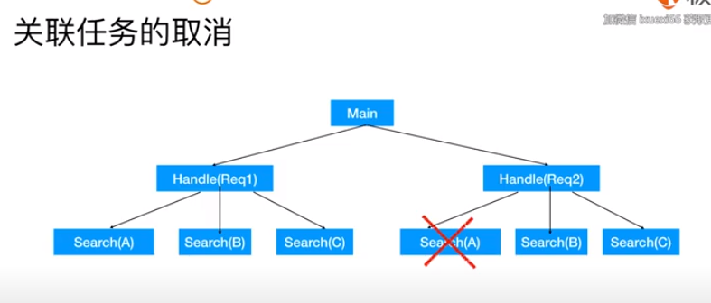


Context

- 根Context, 通过context.Background() 创建

- 子Context: context.WithCancel(parentContext)

   ctx, cancel := contxt.WithCancel(contxt.Background())

- 当前context取消时候，基于他的子context 都会被取消。
- 接收取消通知 <- ctx.Done// cancel()


只运行一次

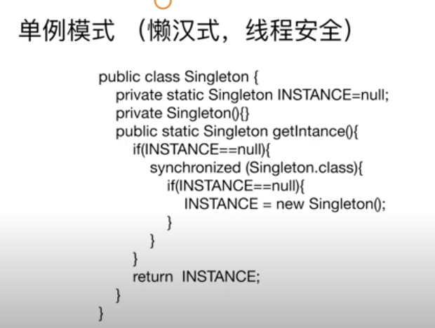

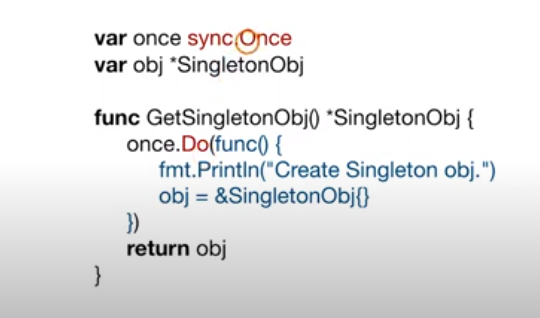


sync.Once() 原理

仅需任意任务完成


所有任务完成


对象池（数据库连接，网络连接）

使用buffered channel实现对象池

归还对象-> chan-> 获取对象


sync pool 对象缓存

sync.Pool 对象缓存？？ sync cache


https://gyazo.com/f8aeaf38cd3069044685d33868e6a12d


https://gyazo.com/c32c6b3b02cbafab85d59d26375f0e71


https://gyazo.com/af2fbba4e5b940ad64a41a570639ca98


sync.Pool 对象的生命周期

- GC会清除sync.Pool 缓存的对象
- 对象缓存的有效期为下次GC之前

只要没有put操作在私有对象池里面是没有的


sync.Pool 总结

- 锁带来的开销大，还是创建对象带来的开销大？
- 
  https://gyazo.com/efb267b39289b30347c7478581d26890


康威定律 DDD

请求进来，向下扇出，并且call很多下游API


单元测试

```go
func Square(n int)int{
    return n*n
}

func TestSquate(t *testing.T){
    inputs:=[...]int{1,2,3}
    expected:=[...]int{1,4,9}
    for i:=0;i<len(inputs);i++{
        ret := Square(inputs[i])
        if ret != expected[i]{
            t.Error("input is %d, the expected is %d, the actual %d",
                   input[i],expected[i],ret)
        }
    }
}
```


内置单元测试框架：

- Fail，Error :该测试失败，该测试继续，其他测试继续执行
- FailNow, Fatal: 该测试失败，该测试终止，其他测试继续执行


代码覆盖率 

go test -v -cover

断言 github.com/stretchr/testify

Benchmark


https://gyazo.com/aca94861bc4d40551e52e55d093947fa


https://gyazo.com/b77c73ac12c5926f0a98c49eddd70e7f

```go
go test -bench=.

```


https://gyazo.com/f5f279536e4e069ed150839d395ee628


BDD

Behavior Driven Development


https://gyazo.com/5d5ffb45da7404bb33ba185700767109


https://gyazo.com/df785c94e5e02756c3dbe12c7fe71707


https://gyazo.com/9a616c400ae7216c310fd4b19a11fae4


https://gyazo.com/be028ad50b5833a27bb799a5683b7bd1


反射编程

reflect.TypeOf vs reflect.ValueOf

- reflect.TypeOf 返回值类型 reflect.Type

- reflect.ValueOf 返回值 reflect.Value

- 可以从reflect.Value 获得类型

- 可以通过kind判断类型

  
  https://gyazo.com/b93fce6a84469927612985a4cfac0e10


https://gyazo.com/c427b98e181d3df67aab98d0f33f08c9

```go

type Employee struct{
	EmployeeId string
	Name string `format:"normal"`
	Age int
}
func(e *Employee)UpdateAge(newVal int){
	e.Age = newVal
}

type Customer struct{
	CookieId string
	Name string
	Age int
}

func TestInvokeByName(t *testing.T){
	e :=&Employee{"1","Mike",30}
	// 直接获取成员
	t.Logf("Name: value(%[1]v),Type(%[1]T)",reflect.ValueOf(*e).FieldByName("Name"))
	// 成员可能不存在
	if nameField,ok := reflect.TypeOf(*e).FieldByName("Name");!ok{
		t.Error("Failed to get 'Name' field.")
	}else{
		t.Log("Tag: format",nameField.Tag.Get("format"))
	}
	reflect.ValueOf(e).MethodByName("UpdateAge").Call([]reflect.Value{reflect.ValueOf(1)})
	t.Log("Updated Age:"e)
}
```


https://gyazo.com/b266dc5d61461672dfe210005190ae8b


万能程序

DeepEqual

比较切片和Map

```go
func TestDeepEqual(t *testing.T){
    a:= map[int]string{1:"one",2:"two",3:"three"}
    b:= map[int]string{1:"one",2:"two",3:"three"}
    t.Log(reflect.DeepEqual(a,b))
    
    s1 := []int{1,2,3}
     s2 := []int{1,2,3}
     s2 := []int{3,2,1}
       t.Log(reflect.DeepEqual(s1,s2))
       t.Log(reflect.DeepEqual(s1,s3))
    
    c1 := Custumer{"1","Mike",40}
     c2 := Custumer{"1","Mike",40}
    t.Log(reflect.DeepEqual(c1,c2))
    
    
}
```


https://gyazo.com/a10a1bcb995573dd695ab27d362ceca1


https://gyazo.com/fc411a9bea3bba9c78f13bb9f47f57a8


https://gyazo.com/ebd871ec44f80daf8b4d50d59fba0a9e


https://gyazo.com/5a7666fe357f7a9576db005cd53eb745


https://gyazo.com/a5b94370bac23e75094e495405c111f1

关于反射你应该知道的

- 提高了程序的灵活性，降低了程序的可读性，降低了程序的性能


不安全编程


https://gyazo.com/917b71d73089020c708b31836cce58b2


https://gyazo.com/f500624a5a03fa01e39bf2cf6f9f3e28


https://gyazo.com/e63eb8f56624a55d773ca820c119b65d


https://gyazo.com/2e992064b118159d0a58a656d017d380


https://gyazo.com/9c90262305e5b81aa0005ff9bf16ca15


https://gyazo.com/a3ca87532dab82e02ec360a144ad18b6


架构模式


https://gyazo.com/3d2dd605b897f106549c2939da35182e

Pipe-Filter 架构


https://gyazo.com/ea75711a765ce8554e2854afb974658e

- 非常适合数据处理以及数据分析系统

- Filter封装数据处理的功能

- 松耦合： Filter只跟数据(格式)耦合

- Pipe用于连接Filter传递数据，或者在异步处理过程中缓冲数据流，

  进程内同步调用时，pipe演变为数据在方法调用间传递


https://gyazo.com/dfe390ab438b9758de391accd05fb082


https://gyazo.com/eb5079cf5f82c333c83af1b90b69078a


https://gyazo.com/674b755eeb2b3bd401d4e1afb79abb3e


内置Json解析


https://gyazo.com/62caf1d3ac52c3641583b05c91e651b3


easyJson 

尽量少的使用反射


https://gyazo.com/9d35fb4b70f7b028d9650d5481b0d297


Go 程序设计语言

面向模式的软件架构

计算机程序的构造和解释
