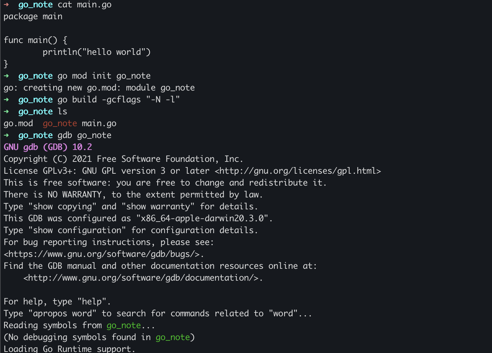
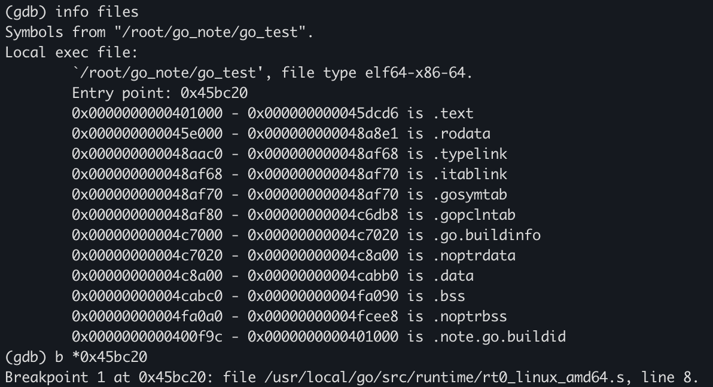
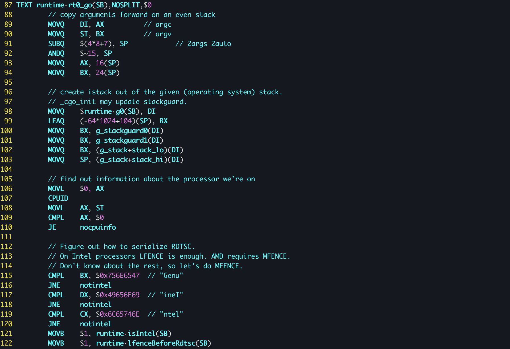
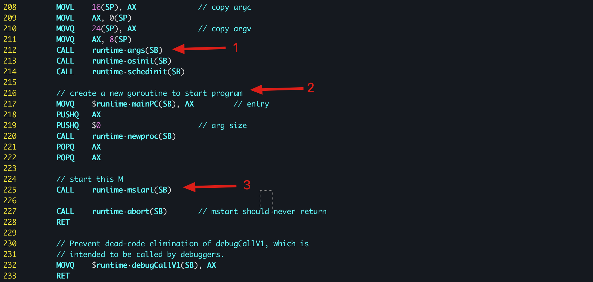
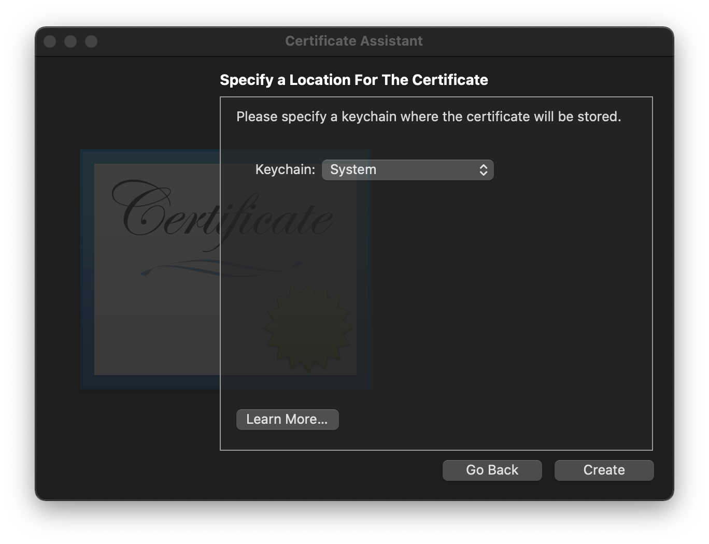

> 重点剖析Go运行时的内部机制，深入了解Go运行期状态，规避GC潜在的问题，节约内存，提升运行性能

## 环境

Mac环境

(**不建议使用，会有很多困扰，直接用Linux**)


### Debian环境


编译好的可执行文件真正的执行入口并不在main.go的mian()函数中。编译器总会插入一段引导代码，完成命令行参数、运行时初始化等工作才会进入用户逻辑。


### 编译&GDB调试

main.go

```go
package main

func main() {
	println("hello world")
}
```

> -gcflags "-N -l" 关闭编译器代码优化和函数内联，避免断点和单步执行无法准确对应源码行，避免小函数和局部变量被优化掉

```sh
go build -gcflags "-N -l" 
# go build -gcflags "-N -l" -o test main.go
```




通过`info files`可以找到程序真正的入口地址`0x105a8c0` ,利用断点命令可以找到目标源文件信息。


> Mac  下breakpoint 并未显示对应的文件信息，以下所有的操作均在Debian中查看。




不同的操作系统就使用不同的汇编文件


下面这这个汇编文件完成了初始化和运行时的启动动作。






1. 调用初始化函数
2. 创建main goroutine用于执行runtime.main
3. 让当前线程开始执行main goroutine


至此，汇编语言针对特定平台的引导过程全部完成，后续的内容基本上都是由Go代码实现的。


go的汇编

Go ASM 和标准的汇编语法（ NASM 或 YASM ）不太一样，首先你会发现它是架构独立的，没有所谓的 32 或 64 位寄存器，如下图所示：


## Tips:Mac 配置gdb环境

[GDB Installation on Mac OS X](https://www.ics.uci.edu/~pattis/common/handouts/macmingweclipse/allexperimental/mac-gdb-install.html)


​	在macOS上，用于debug的工具有lldb和gdb. 其中lldb作为一种可复用的组件，参与了大型llvm项目库的构成；同时，lldb也是Xcode默认的调试工具, 支持Windows, macOS, iOS, Linux和FreeBSD. 而gdb是GNU项目的调试器，支持Windows和大多数UNIX变种，也包括macOS.

```sh
brew install gdb
```

配置证书签名

1. KeyChain Access 新建一个系统证书, 指定Name为`gdb_cert`, Identity Type为`Self Signed Root`，Certificate Type 为`Code Signing`。


2. 一直continue，Keychain为`System`。完成后设置为`Always Trust`。



3. 新建一个叫做`gdb-entitlement.xml`的文件

   ```xml
   <?xml version="1.0" encoding="UTF-8"?>
   <!DOCTYPE plist PUBLIC "-//Apple//DTD PLIST 1.0//EN" "http://www.apple.com/DTDs/PropertyList-1.0.dtd">
   <plist version="1.0">
   <dict>
       <key>com.apple.security.cs.debugger</key>
       <true/>
   </dict>
   </plist>
   ```

4. 执行

   ```sh
   codesign --entitlements gdb-entitlement.xml -fs gdb_cert "${which gdb}"
   # 解决卡死问题
   echo "set startup-with-shell off" >> ~/.gdbinit
   ```

   
