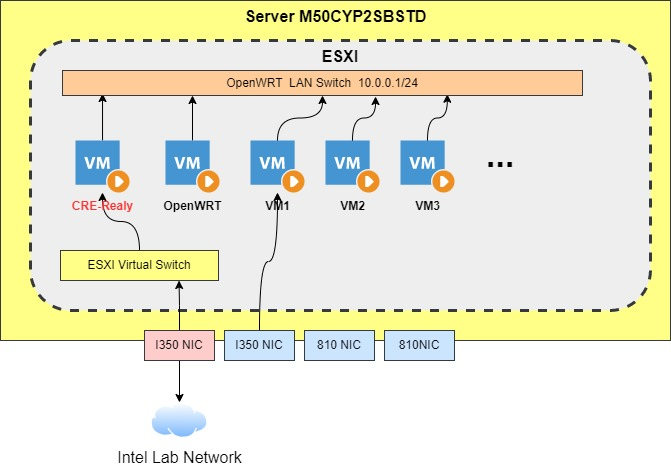
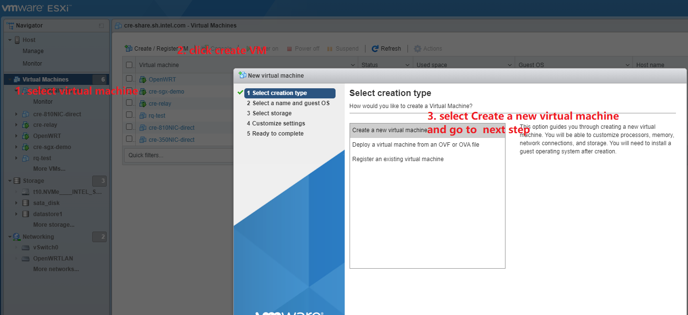
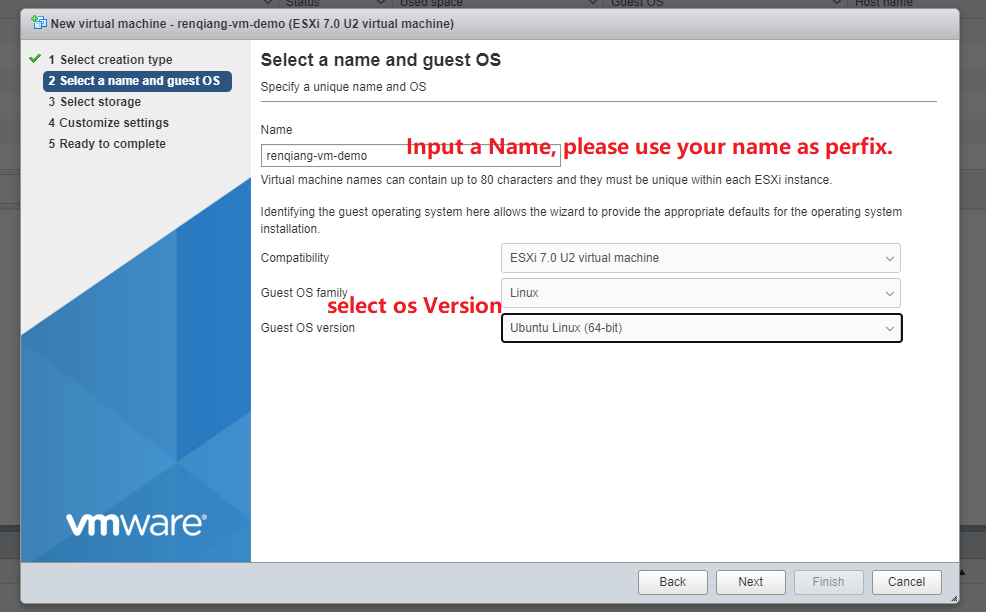
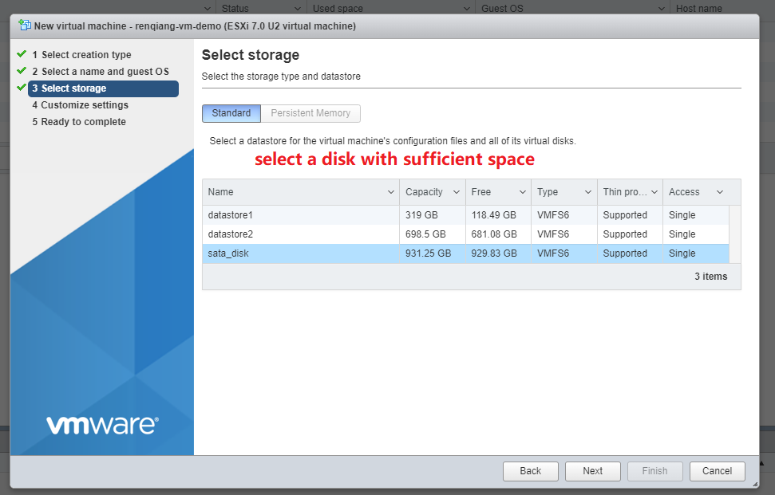
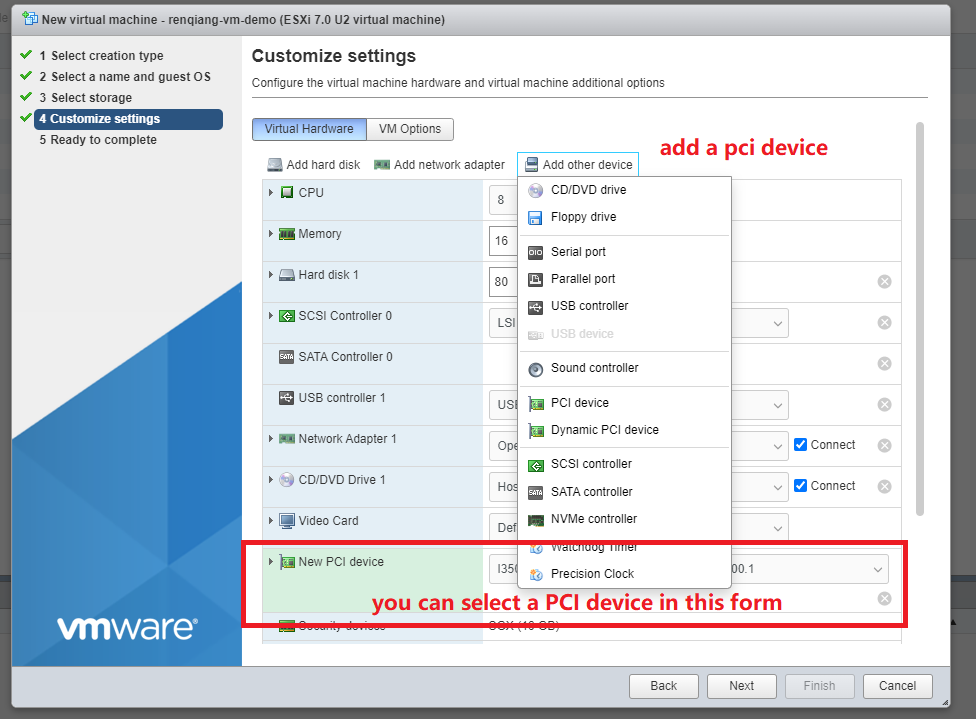
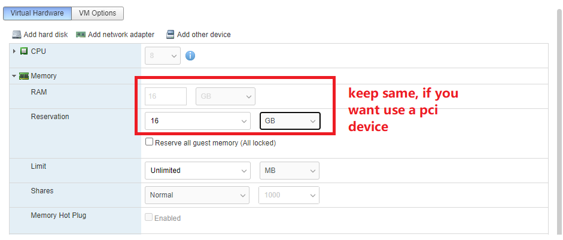
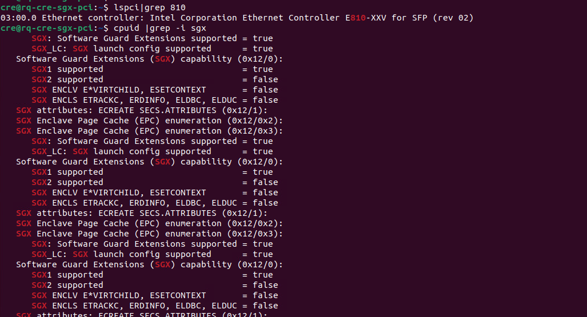

# ESXI configuration and usage




**ESXI admin interface : [https://10.239.241.100/](https://10.239.241.100/)**

```sh
user: root    passwd: CREshare-
```

**跳板机CRE-relay**

```sh
ssh cre@cre-relay.sh.intel.com # 10.239.241.116
user: cre passwd: 123456
```

BIOS：123456/123123


## How to create a VM with SGX and NIC direct mode

### 1.select a creation type



### 2.Select a name and guest OS



### 3.Select storage



### 4.Customize settings, CPU/Mem/Disk/SGX/PCI device, and select an OS image

#### SGX enable


#### Add a PCI device 





#### Select an OS Image


### 5.Start  your machine and check the status



