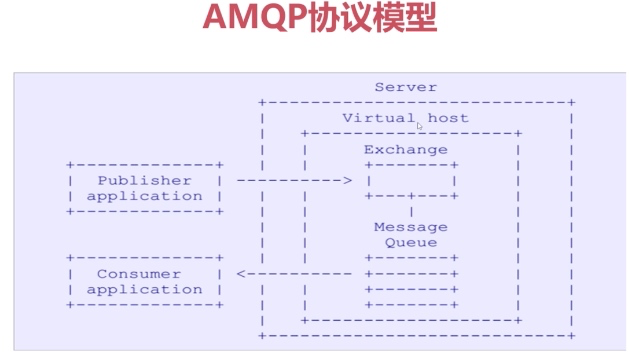
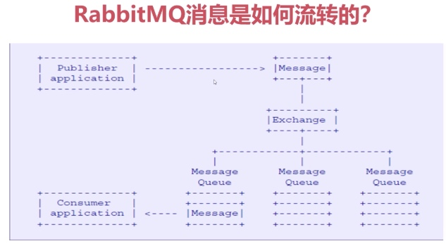
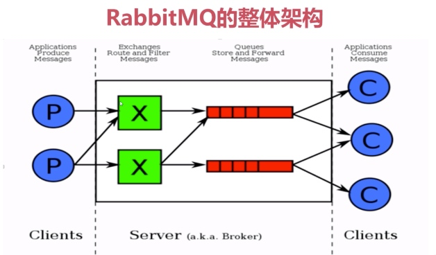
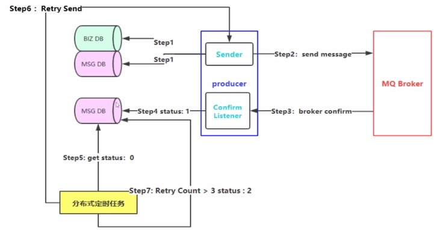
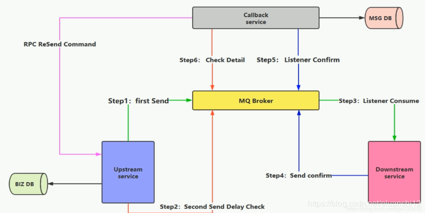
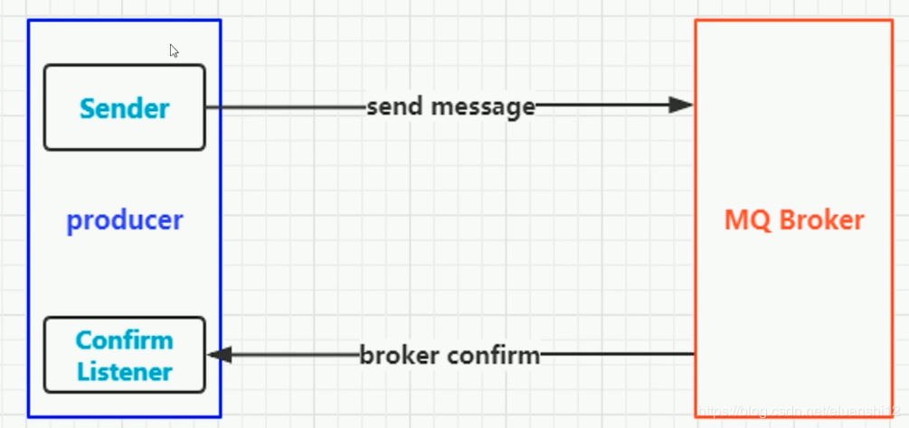
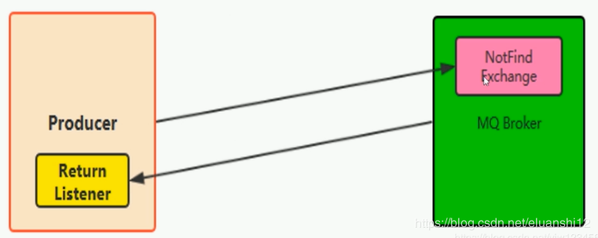

# RabbitMQ 
消息中间件 技术精讲
## 1. RabbitMQ 简介以及AMQP协议
RabbitMQ 是一个开源的消息代理和

- RabbitMQ底层是采用Erlang语言进行编写
- 开源、性能优秀， 稳定性保障
- 与spring AMQP完美整合，API丰富
- 集群模式丰富，表达式配置， HA模式， 镜像队列模型
- 保证数据不丢失的前提做到高可靠性，可用性 
- AMQP： 高级消息队列协议
 


## RabbitMQ 的安装以及使用

erlang
socat
rabbitmq-server
rpm -ivh XXXXX.rpm
lsof -i:5672 # 查看端口
启用控制台插件
rabbit 可以选择使用内存进行存储


## RabbitMQ 核心概念




AMQP核心概念

- Server：又称作Broker， 接收客户端的连接，实现AMQP实体服务

- Connection： 连接， 应用程序与Broker的网络连接

- Channel： 网络信道，几乎所有的操作都在Channel中进行，Channel是进行消息读写的一个通道。客户端可以建立多个Channel，每个Channel代表一个会话任务。

- Message： 消息， 服务器和应用程序之间传送的数据，由Properties和Body组成。Properties可以对消息进行修饰，比如消息的优先级、延迟等高级特性；Body则就是消息体内容。

- Virtual host： 虚拟地址，用于进行逻辑隔离，是最上层的消息路由。一个Virtual Host里面可以有若干个Exchange 和Queue， 同一个Virtual Host里面不能有相同名称的Exchange或Queue。

- Exchange： 交换机，接收消息，根据路由键转发消息到绑定的队列

- Binding： Exchange 和Queue之间的虚拟连接，binding可以包含routing key

- Routing key: 一个路由规则，虚拟机可以用它来确定如何路由一个特定消息

- Queue： 也称为Massage Queue, 消息队列，保存消息并将他们转发给消费者
  
  
  
  


##  RabbitMQ

####  RabbitMQ默认端口号
- 4369 (epmd), 25672 (Erlang distribution) 4369 erlang 发现端口 25672 server间通信端口
- 5672, 5671 (AMQP 0-9-1 without and with TLS) client端通信口
- 15672 (if management plugin is enabled) 管理界面ui端口
- 61613, 61614 (if STOMP is enabled)
- 1883, 8883 (if MQTT is enabled)

#### 生产端的可靠投递
保证消息从生产者到MQ之间的传输是100%可靠的，生产者发送的消息一定能进入消息队列
- 保障消息成功发出， 如果中途由于网络或者其他原因导致发送失败，要保证消息不丢失，可以再次发送。
（如果消息发送成功，但是消费端对消息处理失败，也要考虑消息的重新处理，但不属于此范围）
- 保证MQ节点成功接收到消息
- 发送端要收到MQ节点(Broker)的确认应答
- 完善的消息进行补偿机制？？

###### 方案1： 消息落库，对消息状态进行打标




BIZ DB：订单数据库(或其他具体业务) -- 可以说是消息的Payload，具体的消息内容。
MSG DB：消息发送日志数据库 -- 存储消息的发送状态(发送中 0，已确认 1， Retry>max 之后设置为发送失败 2)，重试次数，发送时间等。

第1步：将订单数据入库，之后创建一条MSG(状态为0) 入MSG DB库
第2步：将消息发送到MQ
第3步：监听消息应答(来自Broker)
第4步：修改消息的状态为1(成功)<font color=red>（只要有应答，MQ一定是收到了消息？消息是否根据exchange和routingKey放入了正确的队列，是否会有异常出现）</font>
第5步：分布式定时任务抓取状态为0的消息
第6步：将状态为0的消息重发
第7步：如果尝试了3次(可按实际情况修改)以上则将状态置为2(消息投递失败状态) 

PS: 这种方案需要**两次入库**，在高并发的场景下性能不是很好。

###### 方案二： 消息延迟投递，做二次确认，回调检查



Upstream service：上游服务，可能为生产端
Downstream service：下游服务，可能为消费端
MQ Broker：MQ
Callback service：回调服务，监听`confirm`消息

第1步：首先业务数据落库，成功才后第一次消息发送
第2步：紧着着发送第2条消息（可以用于寻找第1条消息,消息的ID是唯一的），用于延迟(可能2,3分钟后才发送)消息投递检查
第3步：Broker端收到消息后，消费端进行消息处理
第4步：处理成功后，发送confirm消息（<font color=red>Callback service如何获得confirm信息</font>>）
第5步：收到confirm消息后，将消息进行持久化存储
第6步：收到了delay消息，检查DB数据库，若对应的第1条消息已处理完成，则不做任何事情；若收到了delay消息，检查DB数据库，发现对应的第1条消息处理失败(或无记录)，则发送重传命令到上游服务，循环第1步。

-------------------

**消息的幂等性**

执行某个操作，无论执行多少次，结果都是一致的就说具有幂等性。

例如一条更新库存的SQL语句

```sql
update T_REPS set count=count-1, version=version-1 where version=1
```

第一步查出记录的version，第二步通过这个version信息进行其他字段的更新。这样无论这条SQL执行 多少次，所得到的的结果都是一致的，就保证了幂等性。


**如何避免重复消费**

消费端实现幂等性，然后永远都不会出现重复消费多次的情况，即使受到多条一样的消息


## 消费幂等性

消费端实现幂等性的主流解决方案有以下两种：

- 唯一ID +指纹码 机制

- 利用Redis的原子性实现

#### 唯一ID +指纹码 机制

利用数据库主键去重
指纹码：可能是业务规则，时间戳+具体银行范围的唯一信息码，能保障这次操作的绝对唯一
比如`select count(1) from T_ORDER where id = <唯一ID+指纹码>`
将唯一ID+指纹码设成主键，如果上面SQL返回1，说明已经操作了，则不需要再次操作；否则才去执行操作
优点： 实现简单
缺点：高并发下有数据库写入的性能瓶颈（解决方案：通过ID进行分库分表进行算法路由）

#### **利用Redis的原子性实现**

- 通过setnx等命令

SET 订单号 时间戳 过期时间
```
SET 1893505609317740 1466849127 EX 300 NX
```
利用Redis进行幂等，需要考虑的问题：

如果要进行数据落库，关键解决的问题是数据库和缓存如何做到数据一致性。
如果不落库，那么都存在缓存中，如何设置定时同步的策略(同步是指将数据存储到数据库中，不落库指的是暂时不落库，不可能永远不落库)


## 投递消息机制

#### Confirm确认消息

- 消息确认，是指生产者消息投递后，如果Broker收到消息，则会给生产者一个应答
- 生产者进行接收应答，用来确定这条消息是否正常的发送到Broker，这种方式也是消息的可靠性投递的核心保障

生产者发送消息与监听Confirm是异步的。(<font color=red>Nack是指接收超时吗?</font>)




```Java
public class Producer {

    public static void main(String[] args) throws IOException, TimeoutException, InterruptedException {
        Connection connection = ConnectionUtil.getConn();
        //1. 通过connection创建一个Channel
        Channel channel = connection.createChannel();
        //2.指定消息确认模式
        channel.confirmSelect();
        String exchangeName = "test_confirm_exchange";
        String routingKey = "confirm.save";

        //3. 通过Channel发送数据
        String message = "Hello from Producer";
        channel.basicPublish(exchangeName,routingKey,null,message.getBytes());

        //4. 添加一个确认监听
        channel.addConfirmListener(new ConfirmListener() {
            @Override
            public void handleAck(long deliveryTag, boolean multiple) throws IOException {
                //成功的情况 deliveryTag:消息的唯一标签；
                System.out.println("——get ack——");
            }

            @Override
            public void handleNack(long deliveryTag, boolean multiple) throws IOException {
                //失败的情况
                System.out.println("——have no  ack——");
            }
        });

        // 关闭掉就没confirm了
        // CloseTool.closeElegantly(channel,connection);

    }
}
```

```Java
public class Consumer {

    public static void main(String[] args) throws Exception {
        Connection connection = ConnectionUtil.getConn();

        //1. 通过connection创建一个Channel
        Channel channel = connection.createChannel();

        String exchangeName = "test_confirm_exchange";
        String routingKey = "confirm.save";
        String queueName = "test_confirm_queue";
        //2. 声明一个exchange
        channel.exchangeDeclare(exchangeName,"topic",true);
        //3. 声明一个队列
        channel.queueDeclare(queueName,true,false,false,null);
        //4. 绑定
        channel.queueBind(queueName,exchangeName,routingKey);
        //5. 创建消费者
        QueueingConsumer queueingConsumer = new QueueingConsumer(channel);
        //6. 设置Channel
        channel.basicConsume(queueName,true,queueingConsumer);
        //7. 获取消息
        while (true) {
            //nextDelivery 会阻塞直到有消息过来
            QueueingConsumer.Delivery delivery = queueingConsumer.nextDelivery();
            String message = new String(delivery.getBody());
            System.out.println("收到:" + message);
        }
    }
}
```

####  return返回消息

- Return Listener用于处理一些不可路由消息
- 生产者指定Exchange和RoutingKey，将消息投递到某个队列，然后消费者监听队列，进行消息处理
- 但在某些情况下，在发送消息时，若当前的exchange不存在或指定的路由key路由失败，这时，如果需要监听这种不可达的消息，则要使用return listener

**return 消息机制**

在基础API中有一个关键的配置项：

- `Mandatory` : 若为true,则监听器会接收到路由不可达的消息，然后进行后粗处理 ；若为false，则broker端自动删除该消息

  发送端发送了一条消息，但是没有发现Exchange，则可通过return listener监听这些消息
  
  
  
  

```Java
public class Producer {
    public static final String MQ_HOST = "192.168.222.101";
    public static final String MQ_VHOST = "/";
    public static final int MQ_PORT = 5672;

    public static void main(String[] args) throws IOException, TimeoutException {
        //1. 创建一个ConnectionFactory
        ConnectionFactory connectionFactory = new ConnectionFactory();
        connectionFactory.setHost(MQ_HOST);//配置host
        connectionFactory.setPort(MQ_PORT);//配置port
        connectionFactory.setVirtualHost(MQ_VHOST);//配置vHost

        //2. 通过连接工厂创建连接
        Connection connection = connectionFactory.newConnection();
        //3. 通过connection创建一个Channel
        Channel channel = connection.createChannel();
        String exchange = "test_return_exchange";
        String routingKey = "return.save";
        String routingKeyError = "abc.save";


        //4. 通过Channel发送数据
        String message = "Hello Return Message";

        channel.addReturnListener((replyCode, replyText, exchange1, routingKey1, properties, body) -> {
            System.out.println("——handle return——");
            System.out.println("replyCode:" + replyCode);
            System.out.println("replyText:" + replyText);
            System.out.println("exchange1:" + exchange1);
            System.out.println("routingKey1:" + routingKey1);
            System.out.println("properties:" + properties);
            System.out.println("body:" + new String(body));
        });

        //mandatory : true
        //channel.basicPublish(exchange,routingKey,true,null,message.getBytes());
        channel.basicPublish(exchange,routingKeyError,true,null,message.getBytes());
    }
}
```

```Java

public class Consumer {

    public static void main(String[] args) throws Exception {
        Connection connection = ConnectionUtil.getConn();

        //1. 通过connection创建一个Channel
        Channel channel = connection.createChannel();

        String exchange = "test_return_exchange";
        String routingKey = "return.#";
        String queueName = "test_return_queue";

        //2. 声明一个exchange
        channel.exchangeDeclare(exchange,"topic",true,false,null);
        //3. 声明一个队列
        channel.queueDeclare(queueName,true,false,false,null);
        //4. 绑定
        channel.queueBind(queueName,exchange,routingKey);
        //5. 创建消费者
        QueueingConsumer queueingConsumer = new QueueingConsumer(channel);
        //6. 设置Channel
        channel.basicConsume(queueName,true,queueingConsumer);
        //7. 获取消息
        while (true) {
            //nextDelivery 会阻塞直到有消息过来
            QueueingConsumer.Delivery delivery = queueingConsumer.nextDelivery();
            String message = new String(delivery.getBody());
            System.out.println("收到:" + message);
        }


    }
}
```


当生产端执行`channel.basicPublish(exchange,routingKey,true,null,message.getBytes());`消息能发送成功，也可以从消费端看到打印

当执行`channel.basicPublish(exchange,routingKeyError,true,null,message.getBytes());`消息发送失败，因为路由失败了嘛，生产端能看到如下打印：

```sh
——handle return——
replyCode:312
replyText:NO_ROUTE
exchange1:test_return_exchange
routingKey1:abc.save
properties:#contentHeader<basic>(content-type=null, content-encoding=null, headers=null, delivery-mode=null, priority=null, correlation-id=null, reply-to=null, expiration=null, message-id=null, timestamp=null, type=null, user-id=null, app-id=null, cluster-id=null)
body:Hello Return Message
```

**若生产端将mandatory设为false,则ReturnListener不会进行回调**


## 保障100% 的消息可靠性投递方案落地实现

