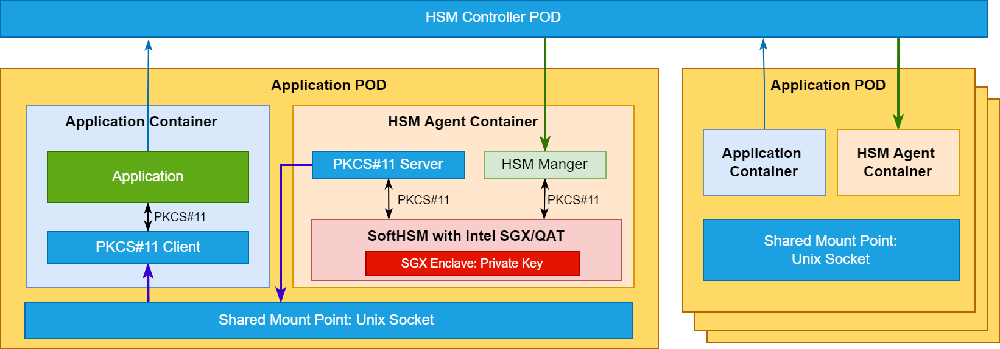
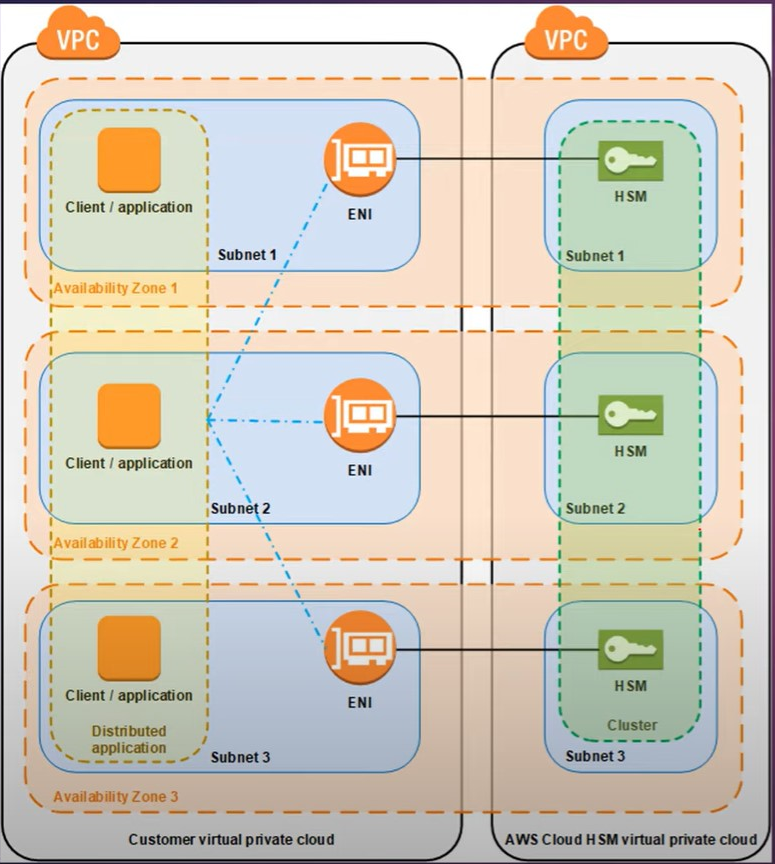
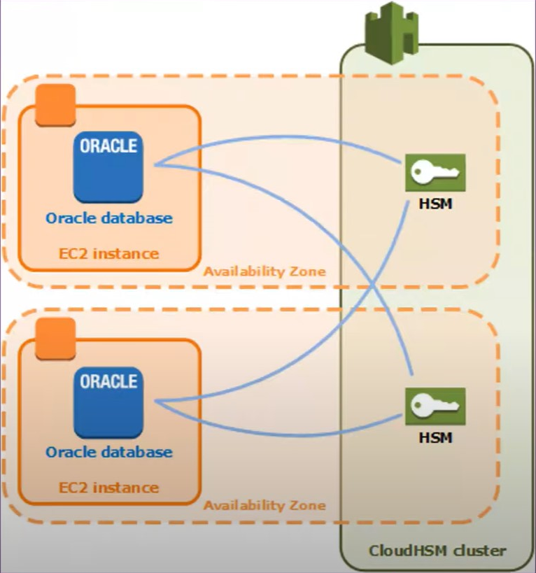

## Patent

Cloud-Native HSM is a cloud-native Hardware Security Module(HSM) service that allows you to host encryption keys in the Intel Software Guard extension enclave and perform cryptographic operations accelerated by QAT in a cluster of HSM. You can manage the HSM resource with the Kubernetes customer resources, so you do not need to worry about scaling, managing, and clustering. You can leverage the Kubernetes' function to provide the HSM  to your service.

This is the architecture of the Cloud Native HSM.

1. If the application needs an HSM device to create a secure connection with a remote host,  you can deploy an HSM agent as a sidecar to work with the application Pod.
2. And then, the application can call the HSM controller to generate a Key Pair and a CSR.
3. The HSM controller received the request and then call the corresponding HSM manager to really create a Key Pair and Generate a CSR from the  CTK for Intel SGX.
4. After that, the application can take the CSR to the remote CA center to get a certificate.
5. The application can put the received certificate to the SGX enclave and cross the HSM controller through the HSM manager.
6. After getting the certificate, the Application can call the Crypoki through the PKCS#11 client and PKCS#11 server to the CTK.

Advantage:

- HSM agent works as a sidecar, and it won't need to make any change in the application code. The application can use the Unix socket to involve the HSM. It keeps the safety of the HSM.
- HSM controller leverages the Kubernetes function to manage the HSM cluster, it's convenient
-  The SGX enhances the security of the data and private key. 

If they use the CTK for Intel SGX as a sidecar, and use the Unix socket to forward the PKCS#11 service between the Pod they will hit the patent.

## AWS Cloud HSM

What is Cloud Hardware Security Module(HSM)?

A hardware security module(HSM) is a computing device that **processes cryptographic operations** and **provides secure storage for cryptographic keys.**

AWS Cloud HSM is a cloud-based hardware security module (HSM) that enables you to genereate and use you own encryption keys.

Cloud HSM is a compliant with FIPS 140-2 level 3 (The Federal Information Processing Stanard Publication 140-2)

It automates administrative tasks like hardware provisioning, sofeware pathcing, high-availability, and backups

Applications can integrate with Cloud HSM using PKCS#11, Java Cryptography Extensions(JCE), and Microsoft CryptoNG (CNG) API libraries.

CloudHSM can scale quickly on-demand with no up-front costs.

### Cloud HSM Cluster

AWS Cloud HSM provides hardware securtiy modules (HSM) in a cluster.

A  cluster is one logical HSM.

To interact with the HSMs in a cluster, you need the AWS Cloud HSM Client software.

Client can be installed on Amazon EC2 instances, known as client instances, that reside in the same VPC as the HSM ENIs.

When you perform a task or operation on the one HSM in  a cluster, the other HSM in that cluster are automatically updated.

You can create a cluster that has from 1 to 28 HSMs (the defaut limit is 6 HSMs per AWS account per AWS region.)

### Benefits

- Generate and manager cryptographic keys
- Cluster based makes it easy to load balance and scale
- API based integration for Applications
- Integrates with AWS KMS to create custom key stores

## Google Cloud HSM

### Cloud HSM

 Cavium Liquid Security HSM

Why Cloud HSM

Complicance

- FIPS 140-2 level 3 certified HSMs

Regionalization

- HSM keys are cryptographically bound to region
- Avaiable in all GCP Regions
- Support for multi-regions

No application changes for Cloud KMS customers

- Same API and client libraries as Cloud KMS

It leverages the exact same API as Cloud KMS,  what that mean is that  if you know how to use cloud KMS, then you know howe to use Cloud HSM.

Key Fearures:

- Global and multi-region support
- Attestation statement
  - confidence your keys are hardware protected
  - Cryptographically signed statement provided by the HSM verifying the creation of the key si within an HSM boundary and non-exportable
  - statement can be verified manually or through a script
  - verify key attriburtes
- CMEK integration

> The HSM is bind with Vm not bind with application Pod
>
> Tenant Separation

### Summary

- Cloud HSM provides a scalable, reliable, and low-maintenance service
- Provides a modern, intergrated approach to  administrative control and tenant isolation
- Keys can be effortlessly created in multi-regions or event a global region.
- HSM keys can be used to seamlessly protect your data-at-rest with CMEK services
- Look for an upcomming Cloud HSM white paper

## What is a Cloud Hardware Security Module

The CloudHSM helps you meet corporate, contractual and regulatory compliance requirements for data security by using dedicated Hardware Secutiry Module(HSM) applicances withing the cloud.

very critical area in the cryptography, Stand out on CV, fundamental topic to learn for cloud security role.

