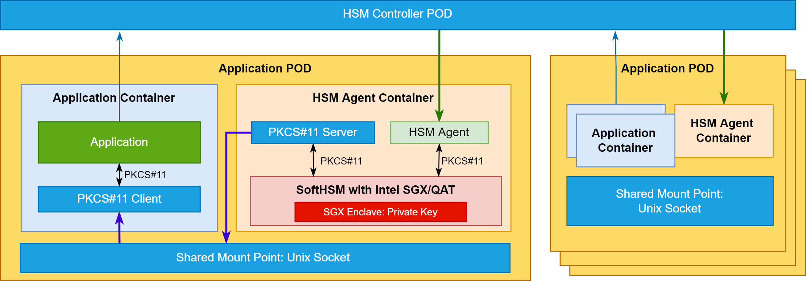

Cloud-Native HSM is a cloud-native Hardware Security Module(HSM) service that allows you to host encryption keys in the Intel Software Guard extension enclave and perform cryptographic operations accelerated by QAT in a cluster of HSM. You can manage the HSM resource with the Kubernetes customer resources, so you do not need to worry about scaling, managing, and clustering. You can leverage the Kubernetes' function to provide the HSM  to your service.

This is the architecture of the Cloud Native HSM.

1. If the application needs an HSM device to create a secure connection with a remote host,  you can deploy an HSM agent as a sidecar to work with the application Pod.
2. And then, the application can call the HSM controller to generate a Key Pair and a CSR.
3. The HSM controller received the request and then call the corresponding HSM manager to really create a Key Pair and Generate a CSR from the  CTK for Intel SGX.
4. After that, the application can take the CSR to the remote CA center to get a certificate.
5. The application can put the received certificate to the SGX enclave and cross the HSM controller through the HSM manager.
6. After getting the certificate, the Application can call the Crypoki through the PKCS#11 client and PKCS#11 server to the CTK.

Advantage:

- HSM agent works as a sidecar, and it won't need to make any change in the application code. The application can use the Unix socket to involve the HSM. It keeps the safety of the HSM.
- HSM controller leverages the Kubernetes function to manage the HSM cluster, it's convenient
-  The SGX enhances the security of the data and private key. 

If they use the CTK for Intel SGX as a sidecar, and use the Unix socket to forward the PKCS#11 service between the Pod they will hit the patent.

