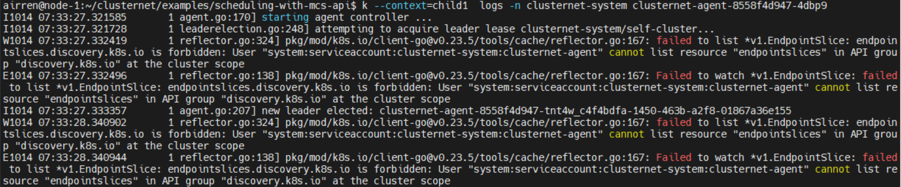

# Cluster Net 


## Test Environment Access method

```sh
# this machine is out of intel, please use the socks proxy: proxy-prc.intel.com:1080
# use this private key to access this the relay machine: http://sdewan.sh.intel.com:8888/private-key/key.pem

# first login to
ssh -p 3302 airren@124.223.99.93  # passwd: 123-


```


- ClusterRegistrationRequest:  This is cluster-agent created in parent-cluster for child-cluster.

  ```sh
  k get clsrr 
  ```

- ManagedCluseter:  clusternet-hub approved the clsrr and created this object

  ```sh
  k get mcls -A
  ```

- HelmChart: helm chart configuration
- Subscription:   the resource for the child cluster.  with a Base Object in corresponding namespace
- Localization and Globalization  
- Base
- Description


# MultiCluster API

#### ServiceExport

`ServiceExport`, used to specify which service should be exposed across all clusters in the `clusterset`. `ServiceExport` must be created in each cluster that the underlying `Service` reside in. Creation of a `ServiceExport` in a cluster will  signify that `Service` with the same name and namespace as the export should be visible to other clusters in the `clusterset`.

#### ServiceImport

`ServcieImport` is introduced to act as the in-cluster representation of a multi-cluster service in each importing cluster. This is analogous to the traditional `Service` type in Kubernetes, Importing clusters will have a corresponding `ServiceImport` for each uniquely named `Service` that has been exported within the clusterset, referenced by namespaced name. `ServiceImport` resources will be managed by the MCS implementation's `mcs-controller.`


## Degug of Clusternet



what is scheme?

39b42357-31f0-4bdd-ad53-ebbbb049f0c8

f

8be80212-b32f-4fd8-bd56-2bb2943346a8

## Reference


https://github.com/clusternet/clusternet/tree/main/examples/scheduling-with-mcs-api

https://github.com/kubernetes/community/tree/master/sig-multicluster

https://github.com/kubernetes/enhancements/tree/master/keps/sig-multicluster/1645-multi-cluster-services-api


```sh
$env:HTTP_PROXY="proxy-prc.intel.com:913"
$env:HTTPS_PROXY="proxy-prc.intel.com:913"
```


