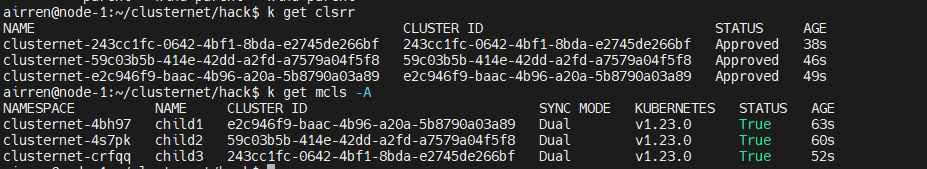
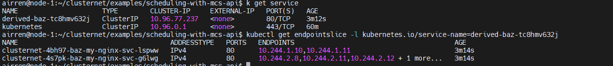

# Cluster Net 


## Test Environment Access method

```sh
# this machine is out of intel, please use the socks proxy:
#                 proxy-prc.intel.com:1080
# use this private key to access this the relay machine: 
# first login to
ssh -p 3302 airren@124.223.99.93  # passwd: 123-
# next login to 
ssh airren@node-1   # passwd:123-
```


## PreRequisites

### Kind 


Create cluster

```sh
# create cluster one node


# create cluster multinode

# create cluster with configuration

```

Delete cluster

```sh
kind delete cluster --name=<clustername>
```


## Setup mcs-api demo 


1. Re-setup 4 cluster. This will create 4 K8s clusters by `Kind`.   parent, child1,child2,child3.

   ```sh
   cd ~/clusternet/hack
   ./local-running.sh
   
   export KUBECONFIG=${HOME}/.kube/clusternet.config
   
   ```
    After that, you will see 4 clusters' contexts.

   

2. Check Clusters status

   

3. Deploy application to child-clusters by `kubectl clusternet`.

   - Change the cluster id in subscription.yaml to what you want to be deployed.

   ```sh
   cd ~/clusternet/examples/scheduling-with-mcs-api/scheduling
   vi subscription.yaml
   ```

   

   - Deploy the applicaton(deployment, servcie, service-export) to the child-cluster

     ```sh
     cd ~/clusternet/examples/scheduling-with-mcs-api/
     k clusternet apply -f scheduling/
     ```

     

   - Deploy the service import in the Parent-Cluster

     ```sh
     k apply -f service-import.yaml
     ```

4. Check the deploy result.

   successfullycreated a service.and then, find the `endpointslice` bind with this service			




The service port name shoule be same with the endpoint slice Name.


## Archtecture


Clusternet is a lightweight addon that consists of three components, `clusternet-agent`, `clusternet-scheduler` and`clusternet-hub`.

**Clusternet-agent** is responsible for:

- Auto-registering current cluster to parent cluster as a child cluster.
- Report heartbeats of current cluster, including kubernetes version, running platform, `health/readyz/livez` status,etc;
- setting up websocket connection that provides full-duplex communication channels over a single TCP connection to parent cluster.

Clusternet-scheduler is responsible for 

- scheduling resources/feeds to marched child clusters based on `SchedulingStrategy`.

Clusternet-hub is responsible for

- approving cluster registration request and creating dedicated resources, suce as namespaces, servceaccounts and RBAC rules, for each child cluster;

- Serving ad an aggregated apiserver(AA),which is used to provide shadow APIs and serve as a websocket server that maintain multiple active webscoket connections form child clusters;

- providing Kubernetes-styled API to redirect/proxy/upgrade request to each child cluster.

- coordinating and deploying applications to multiple clusters from a single set of APIs;

  


- ClusterRegistrationRequest:  This is cluster-agent created in parent-cluster for child-cluster.

  ```sh
  k get clsrr 
  ```

- ManagedCluseter:  clusternet-hub approved the clsrr and created this object

  ```sh
  k get mcls -A
  ```

- HelmChart: helm chart configuration
- Subscription:   the resource for the child cluster.  with a Base Object in corresponding namespace
- Localization and Globalization  
- Base
- Description


# MultiCluster API

#### ServiceExport

`ServiceExport`, used to specify which service should be exposed across all clusters in the `clusterset`. `ServiceExport` must be created in each cluster that the underlying `Service` reside in. Creation of a `ServiceExport` in a cluster will  signify that `Service` with the same name and namespace as the export should be visible to other clusters in the `clusterset`.

#### ServiceImport

`ServcieImport` is introduced to act as the in-cluster representation of a multi-cluster service in each importing cluster. This is analogous to the traditional `Service` type in Kubernetes, Importing clusters will have a corresponding `ServiceImport` for each uniquely named `Service` that has been exported within the clusterset, referenced by namespaced name. `ServiceImport` resources will be managed by the MCS implementation's `mcs-controller.`


## Debug of Clusternet


## Reference


https://github.com/clusternet/clusternet/tree/main/examples/scheduling-with-mcs-api

https://github.com/kubernetes/community/tree/master/sig-multicluster

https://github.com/kubernetes/enhancements/tree/master/keps/sig-multicluster/1645-multi-cluster-services-api


```sh
$env:HTTP_PROXY="proxy-prc.intel.com:913"
$env:HTTPS_PROXY="proxy-prc.intel.com:913"
```


