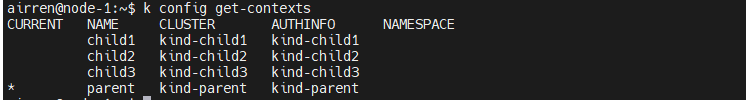
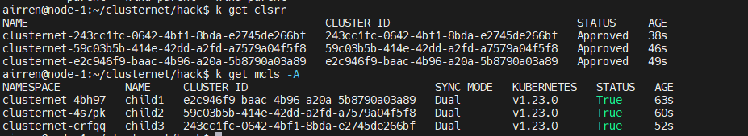
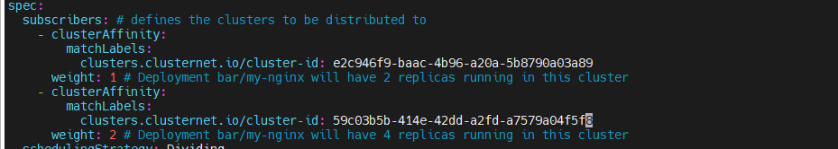
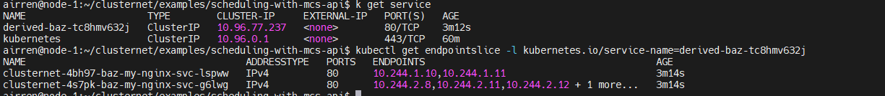

# Cluster Net 

## Test Environment Access method

```sh
# this machine is out of intel, please use the socks proxy:
#                 proxy-prc.intel.com:1080
# first login to
ssh -p 3302 airren@124.223.99.93  # passwd: 123-
# next login to 
ssh airren@node-1   # passwd:123-
```


## Setup mcs-api demo

> The repo is downloaded at `~/clusternet`. There contains some modification, such as creating a k8s cluster with different POD CIDR,  and fixing the `Angent` helm chart problem that doesn't have access to `endpointslice`.  You can see the modification though `git status`.


###### 1.  Re-setup 4 cluster. This will create 4 K8s clusters by `Kind`.   parent, child1,child2,child3.

   ```sh
   cd ~/clusternet/hack
   ./local-running.sh
   
   ```
After that, you will see 4 clusters	 contexts.


###### 2.  Check Clusters status

   

###### 3. Deploy application to child-clusters by `kubectl clusternet`.

   - Change the cluster id in subscription.yaml to what you want to be deployed.

   ```sh
   cd ~/clusternet/examples/scheduling-with-mcs-api/scheduling
   vi subscription.yaml
   ```

   

   - Deploy the applicaton(deployment, servcie, service-export) to the child-cluster

     ```sh
     cd ~/clusternet/examples/scheduling-with-mcs-api/
     k clusternet apply -f scheduling/
     ```

     

   - Deploy the service import in the Parent-Cluster

     ```sh
     k apply -f service-import.yaml
     ```

###### 4. Check the deploy result.


   successfully created a service.and then, find the `endpointslice` bind with this service			




> But, while I on the Parent Cluster pod, try to call the service, it doesn't work. I still try to figure out it.


