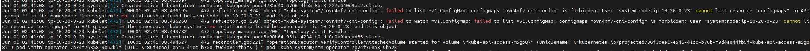
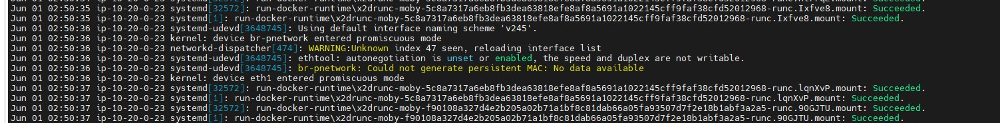

ICN-SDWAN-Virginia   **AWS2**

| **IPv4 Prefixes**       | **Public IPv4** | **Private IPv4** |
| ----------------------- | --------------- | ---------------- |
| ICN-SDWAN-Virginia-Eth1 | 3.211.4.230     | 10.20.0.232      |
| ICN-SDWAN-Virginia-Eth0 | 34.230.111.156  | 10.20.0.23       |

 

ICN-SDWAN- California **AWS5**

| **IPv4 Prefixes**         | **Public IPv4** | **Private IPv4** |
| ------------------------- | --------------- | ---------------- |
| ICN-SDWAN-California-Eth1 | 54.177.9.32     | 172.16.182.169   |
| ICN-SDWAN-California-Eth0 | 54.241.18.249   | 172.16.182.237   |

 iptables -I POSTROUTING -d 172.17.0.2/32 -j SNAT --to-source 192.169.0.4 -t **nat**


AWS2 eth1 MAC Address

 0e:4e:31:15:1a:ed

0e:4e:31:15:1a:ed

```sh
ip addr add 10.20.0.232/20 dev 
```


```sh
eth1: <BROADCAST,MULTICAST,UP,LOWER_UP> mtu 1500 qdisc mq state UP group default qlen 1000     link/ether 0e:4e:31:15:1a:ed brd ff:ff:ff:ff:ff:ff                                             inet 10.20.0.232/20 brd 10.20.15.255 scope global eth1                                         valid_lft forever preferred_lft forever                                                         inet6 fe80::c4e:31ff:fe15:1aed/64 scope link                                                    valid_lft forever preferred_lft forever 
```




http://sdewan.sh.intel.com:10880/xiaoxime/SDEWAN-SetUp/commit/9566bb2f179c034c4b57da9047ae00e42ba2affa


Open Switch

```sh
# all in controller pod
ovs-vsctl
ovn-nbctl
```


### Use Tmux

Connect to the Host

```
ssh ubuntu@sdewan.sh.intel.com  passwd: 123456
```

There are four windows of tmux for different SDEWAN cluster

```sh
tmux a -t vpn
```


**Use multispass**

Connect to the Host

```
ssh ubuntu@sdewan.sh.intel.com  passwd: 123456
```

```sh
# run the following command to enter different VM

m shell vpn-overlay
m shell vpn-hub
m shell vpn-edge-1
m shell vpn-edge-2
```


end


1. Form Virgina to California

   |            | Vigina         | California  | Protocol | Result | Protocal | Result |
   | ---------- | -------------- | ----------- | -------- | ------ | -------- | ------ |
   | eth1(CNF)  | 3.211.4.230    | 54.177.9.32 | ICMP     | PASS   | SSH(22)  | Failed |
   | eth0(Host) | 34.230.111.156 | 54.177.9.32 | ICMP     | PASS   | SSH(22)  | PASS   |

2. From California to Virgina

   |            | California    | Vigina      | Protocol | Result | Protocal | Result |
   | ---------- | ------------- | ----------- | -------- | ------ | :------- | ------ |
   | eth1(CNF)  | 54.177.9.32   | 3.211.4.230 | ICMP     | PASS   | SSH(22)  | Failed |
   | eth0(Host) | 54.241.18.249 | 3.211.4.230 | ICMP     | PASS   | SSH(22)  | Failed |


AWS3-Virginia

| Interface | Public IP    | Local IP    |
| --------- | ------------ | ----------- |
| eth0      | 35.169.8.124 | 10.20.0.129 |
| eth1      | 3.83.186.169 | 10.20.0.213 |


hhh


AWS4- California

| Interface | Public IP      | Local IP       |
| --------- | -------------- | -------------- |
| eth0      | 54.215.142.138 | 172.16.182.54  |
| eth1      | 50.18.65.42    | 172.16.182.149 |


About AWS IPsec Tunnel Test


Now we can successful create IPsec Tunnel between Two CNF on AWS VM  located in different region. This verified the the possibility of using SDEWAN with Nodus in WAN.
