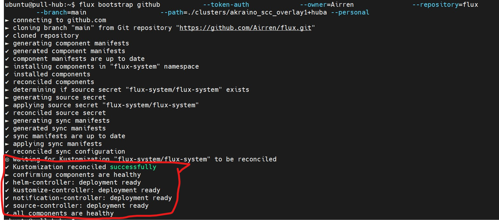

## SDEWAN: Setup by pull mode

> **Version requirement:**
>
> ​	Ubuntu: 20.04
>
> ​	scc: build from https://github.com/intel-sandbox/akraino-sdewan/tree/rc-22.06
>
> ​	cnf: `docker pull integratedcloudnative/sdewan-cnf:0.5.3`
>
> 	crd-controller:  `docker pull integratedcloudnative/sdewan-controller:0.5.3`


### 0.Create an Github repo for pull mode

​	Create an Github repo for SDEWAN pull mode, for example: https://github.com/airren/flux

​    Next, prepare an `Personal access tokens` for SDEAN to access the repo.

 - Update your repo info and token to this file `SDEWAN-SetUp/ewo-tools/cluster-sync-object.yaml`.

    ```yaml
    # SDEWAN-SetUp/ewo-tools/cluster-sync-object.yaml
    ---
    # creating cluster-sync-obj
    version: ewo/v1
    resourceContext:
    anchor: overlays/overlay1/cluster-sync-objects
    metadata:
    name: cso2
    description:
    userData1:
    userData2:
    spec:
    kv:
    - gitType: github
    - userName: Airren  # change to your own github username
    - gitToken: ghp_LaAMXYmdcSWbmSOpL   # change to your own
    - repoName: flux                 # change to your own
    - branch: main
    
    ```


- Update the `GITHUB_TOKEN` in `SDEWAN-SetUp/setup_flux.sh`

- Update the repo info and token in `SDEWAN-SetUp/monitor_stuff/monitor_configs`

  ```sh
  username=Airren  # change to your own
  token=ghp_LaAMXYmdcSWbmSOp9fQPL # change to your own
  repo_name=flux
  cluster=akraino_scc_overlay1+edge-1
  http_proxy=http://proxy-prc.intel.com:913
  https_proxy=http://proxy-prc.intel.com:913
  ```

  

### 1. Setup 4 VMs with SDEWAN base components

```sh
./0_auto_setup.sh -n <vm-perfix>
```

After that, you will install most the components of SDEWAN.  But due to the proxy limitation, we have to do some check work manually.


a. Add proxy configuration to the git repo for Hub/Edge-1/Edge-2. https://github.com/Airren/flux/blob/main/clusters/akraino_scc_overlay1%2Bedge-2/flux-system/kustomization.yaml


```yaml
patches:
  - patch: |
      apiVersion: apps/v1
      kind: Deployment
      metadata:
        name: all
      spec:
        template:
          spec:
            containers:
              - name: manager
                env:
                  - name: "HTTPS_PROXY"
                    value: "http://proxy-prc.intel.com:913"
                  - name: "HTTP_PROXY"
                    value: "http://proxy-prc.intel.com:913"
                  - name: "NO_PROXY"
                    value: "10.0.11.1/24,10.95.62.1/16,192.169.0.1/24,192.168.0.1/24,10.233.0.1/16,localhost,10.96.0.1/24,192.168.174.0/24,172.17.0.1/24,.cluster.local.,.cluster.local,.svc"
    target:
      kind: Deployment
      labelSelector: app.kubernetes.io/part-of=flux
```


b. Re run flux init on Hub/Edge-1/Edge-2, check the result

```sh
# for hub cluster
setup_flux.sh hub
# for edge-1 cluster
setup_flux.sh edge-1
# for edge-2 cluster
setup_flux.sh edge-2

```



c. Re-deploy monitor if need on Hub/Edge-1/Edge-2 respectively.

```sh
SDEWAN-SetUp/monitor_stuff/monitor-deploy.sh
```

### 2.Register Overlay

```sh
cd SDEWAN-SetUp/ewo-tools 
./ewoctl --config ./ewo-config.yaml apply -f pre.yaml
./ewoctl --config ./ewo-config.yaml apply -f cluster-sync-object.yaml
```

### 3.Register Hub/Edge-1/Edge-2

```sh
cd SDEWAN-SetUp/ewo-tools 
./ewoctl --config ./ewo-config.yaml apply -f huba.yaml
./ewoctl --config ./ewo-config.yaml apply -f edge-1.yaml
./ewoctl --config ./ewo-config.yaml apply -f edge-2.yaml

```

#### 4.Register Hub/Edge-1/Edge-2

```sh
cd SDEWAN-SetUp/ewo-tools 
./ewoctl --config ./ewo-config.yaml apply -f huba-edge-1-con.yaml
./ewoctl --config ./ewo-config.yaml apply -f huba-edge-2-con.yaml
```

### 5.Deploy Application as before.


## Other Notes: (Not Need, Just for Debug)

```sh
 kubectl patch deployments.apps -n flux-system source-controller --patch-file patch.yaml
 
 k patch deployments.apps -n sdewan-system rsync --patch-file rsync-patch.yaml
```


