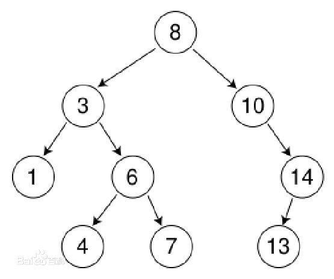

# 二叉排序树
二叉排序树（Binary Sort Tree），又称二叉查找树（Binary Search Tree），亦称二叉搜索树。
## 定义
二叉排序树或者是一个棵空树，或者具有下列性质的二叉树
- 若左子树不空，则左子树上所有节点的值均小于它的根节点的值；
- 若右子树不空，则右子树上所有节点的值均大于它的根节点的值；
- 左、右子树也分别为二叉排序树；
- 没有键值相等的节点。

#### 查找
时间复杂度：O(logn)
步骤：
1. 若根结点的关键字值等于查找的关键字，成功。
2. 否则，若小于根结点的关键字值，递归查左子树。
3. 若大于根结点的关键字值，递归查右子树。
4. 若子树为空，查找不成功。

#### 插入
首先执行查找算法，找出被插结点的父亲结点。
判断被插结点是其父亲结点的左、右儿子。将被插结点作为叶子结点插入。
若二叉树为空。则首先单独生成根结点。
注意：新插入的结点总是叶子结点。

#### 删除
在二叉排序树删去一个结点，分三种情况讨论：
1. 若*p结点为叶子结点，即PL(左子树)和PR(右子树)均为空树。由于删去叶子结点不破坏整棵树的结构，则可以直接删除此子结点。
2. 若`*p`结点只有左子树PL或右子树PR，此时只要令PL或PR直接成为其双亲结点`*f`的左子树（当`*p`是左子树）或右子树（当*p是右子树）即可，作此修改也不破坏二叉排序树的特性。
3. 若`*p`结点的左子树和右子树均不空。在删去*p之后，为保持其它元素之间的相对位置不变，可按中序遍历保持有序进行调整，可以有两种做法：
其一是令`*p`的左子树为`*f`的左/右(依`*p`是`*f`的左子树还是右子树而定)子树，`*s`为`*p`左子树的最右下的结点，而`*p`的右子树为`*s`的右子树；
其二是令`*p`的直接前驱（或直接后继）替代`*p`，然后再从二叉排序树中删去它的直接前驱（或直接后继）－即让`*f`的左子树(如果有的话)成为`*p`左子树的最左下结点(如果有的话)，再让`*f`成为`*p`的左右结点的父结点。
在二叉排序树上删除一个结点的算法如下：