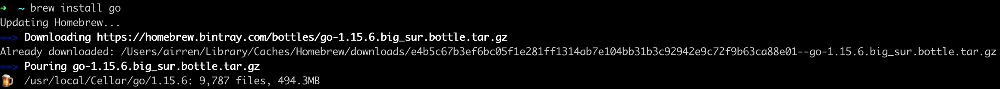
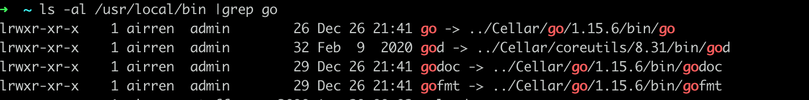

## 1. 安装Go

所有开发默认使用Mac环境，使用brew可以安装并管理go多个版本

```sh
brew install go  # 安装go最新版本
```



```sh
go version # 查看go版本
```

安装路径




## 2.  Brew 管理多版本的Go

安装指定版本1.14

```sh
brew install go@1.14
```

安装路径

```sh
/usr/local/Cellar/go@1.14/1.14.9
```

切换go的版本到1.14, 这个地方具体的操作需要根据`homebrew`的具体版本进行操作

```sh
brew unlink go
brew link --overwrite go@1.14
```


